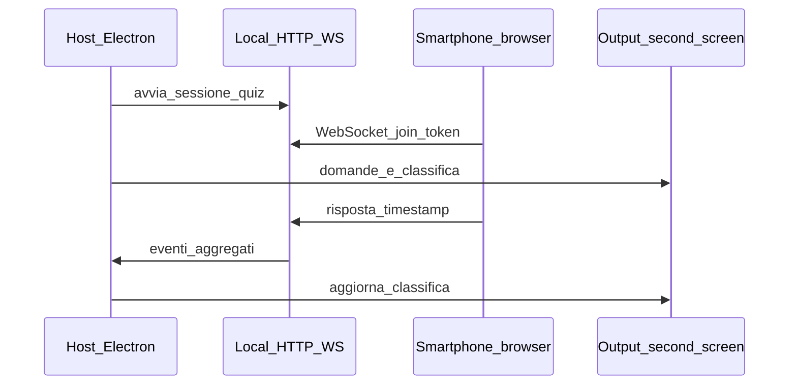

# Plugin: dove vivono e come pensare al Quiz

## Telecomando = primo plugin

Sì: il modello plugin può (e conviene) **iniziare dal telecomando**. Nell’implementazione corrente è modellato così: **host** con server LAN unico + **plugin `remote`** che monta `/remote/`, `/api/remote/v1`, messaggi WS `channel: "remote"`. Il Quiz diventa naturalmente il **secondo** plugin (`quiz`, `/quiz/`, `channel: "quiz"`) senza duplicare il trasporto.

Esempio naming pacchetti: `packages/regia-plugin-api` (tipi contratto), `packages/regia-plugin-remote` (telecomando), `packages/regia-plugin-quiz` — oppure cartelle `plugins/remote` e `plugins/quiz` finché non estrai i package.

---

## Allineamento con Telecomando (LAN + QR)

Il lavoro sul telecomando non è stato solo infrastruttura: è stata la **prima implementazione del contratto plugin** oltre alle feature telecomando.

- **Opzione A**: server HTTP (+ WebSocket) nel **main**, bind LAN, **token nel QR** (URL sotto `/remote/?token=…` come nell’app).
- Il plugin `remote` usa la pipeline regia: playlist via IPC, `playback:send` / `PlaybackCommand` (dettaglio in codice host e modulo remote sotto [`electron/`](/Users/mauroandreoni/Regia%20Video/electron/)).

**Plugin Quiz**: stesso server, route e channel dedicati, secondo QR o link dalla regia; token e policy LAN restano nell’host.

---

## Risposta diretta: repo unico vs progetto per plugin

**Non serve un repository Git separato per ogni plugin** a meno che non ci siano team, licenze o segreti davvero isolati. L’approccio più solido per la tua app (Electron + React in [`package.json`](/Users/mauroandreoni/Regia%20Video/package.json)) è un **monorepo** con **pacchetti separati** (es. `packages/regia-plugin-api`, `packages/regia-plugin-remote`, `packages/regia-plugin-quiz`):

- **Ciclo di aggiornamento indipendente**: ogni pacchetto ha versione propria (npm workspaces + [changesets](https://github.com/changesets/changesets) o equivalente); puoi pubblicare solo il plugin su registry privato o includerlo nel build dell’app quando serve.
- **Confini chiari**: il core espone solo un **contratto** (tipi, hook, capacità dichiarate); il plugin implementa UI + logica senza toccare ovunque `RegiaContext`.
- **Build Electron**: i plugin “seri” in Electron finiscono quasi sempre **bundlati** o copiati in `app.asar` / cartella `resources`: il “progetto separato” è il **pacchetto**, non per forza un altro repo.

**Repo separati** hanno senso se: plugin sviluppati da terzi con NDA, open source separato, o CI/release completamente disaccoppiate; il costo è duplicazione di toolchain, allineamento versioni API e integrazione manuale nel build.

**Sintesi consigliata**: **monorepo + un package per plugin**; estrai in repo separato solo quando il confine organizzativo lo impone.

---

## Cosa mettere nel core vs nel plugin

| Nel progetto principale (host) | Nel modulo plugin |
|-------------------------------|-------------------|
| Definizione API plugin (lifecycle, registry, mount route/WS) | Plugin **remote**: UI telecomando, API playlist/pad, comandi playback; plugin **quiz**: domande, classifica, join giocatori |
| Caricamento / wiring (abilitazione server LAN, menu Impostazioni) | Regole di punteggio Quiz (300→200, 0, -50→-200); logica pad/slot nel solo `remote` |
| Infrastruttura condivisa: **un solo server HTTP/WS** in [`electron/main.ts`](/Users/mauroandreoni/Regia%20Video/electron/main.ts) avviato dall’host; i plugin solo registrano mount | Handler WS per `channel` quiz; niente seconda porta |

Oggi il pattern più vicino a “più superfici sincronizzate” è il **floater playlist** via payload serializzabile ([`src/floater/playlistFloaterSync.ts`](/Users/mauroandreoni/Regia%20Video/src/floater/playlistFloaterSync.ts)): per il Quiz replicheresti l’idea (stato + comandi) ma verso **client browser su smartphone** invece che verso un’altra finestra Electron.

---

## Esempio PLUGIN QUIZ (stesso canale LAN del telecomando)

**Flusso concettuale** (LAN, router comune):

- **Smartphone**: pagina web leggera (stesso WiFi, URL tipo `http://IP-PC:PORTA/quiz?token=…`) con pulsanti A/B/C/D; niente installazione se non vuoi.
- **Schermo regia / output**: finestra o canale già usato per il video ([`src/OutputApp.tsx`](/Users/mauroandreoni/Regia%20Video/src/OutputApp.tsx)) esteso o dedicato al plugin per domande + classifica in tempo reale.
- **Punteggi**: conviene centralizzare nel **server (main process)** per avere un solo orologio di riferimento, ordinare i “correct” per tempo di arrivo del messaggio e applicare le tue fasce (es. mappatura lineare 300→200 sul tempo relativo all’apertura della domanda, soglie per astensione e penalità per errore).

**Attenzioni pratiche**: firewall macOS, binding su `0.0.0.0` vs solo localhost, HTTPS opzionale in LAN, token di sessione per evitare join casuali, e latenza rete (per una classifica “velocità” il confronto è coerente se tutti usano lo stesso server come riferimento temporale).

---

## Prossimi passi se vorrai implementarlo

1. **Contratto plugin + host LAN** nello stesso incremento: registry, avvio/stop server, smistamento envelope WS; l’equivalente di `plugin-host-minimum` è già presente nell’host con il plugin `remote` attivo.
2. **Plugin `remote`**: tutto ciò che oggi è descritto come telecomando (token QR `/remote/`, schede playlist/launchpad, `playback:send`).
3. **Plugin `quiz`**: UI mobile, round, classifica su [`OutputApp`](/Users/mauroandreoni/Regia%20Video/src/OutputApp.tsx) o finestra dedicata, mount `/quiz/` e `channel: "quiz"`.

Non è necessario decidere subito monorepo tooling (workspaces): si può iniziare con `plugins/remote` e `plugins/quiz` nel repo ed estrarre in package quando l’API si stabilizza.
