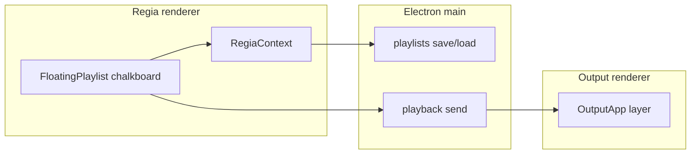

# Chalkboard in playlist

## Contesto codice

- Tipi playlist oggi: [`tracks` | `launchpad`](src/playlistTypes.ts), sessione in [`FloatingPlaylistSession`](src/state/floatingPlaylistSession.ts), persistenza in [`electron/main.ts`](electron/main.ts) (`StoredPlaylistEntry`, `playlists:save` / `playlists:load`, duplicazione).
- UI pannello: [`FloatingPlaylist.tsx`](src/components/FloatingPlaylist.tsx) (striscia titolo, help, pin, riduci, chiudi; toolbar tema / salva / undo identica per tracks e launchpad; corpo `isLaunchpad` → griglia + [`launchpad-bank-tabs`](src/index.css) con `LAUNCHPAD_BANK_COUNT = 4`).
- Nuovi pannelli dalla sidebar: [`SidebarTabsPanel.tsx`](src/components/SidebarTabsPanel.tsx) + lista salvati [`SavedPlaylistsPanel.tsx`](src/components/SavedPlaylistsPanel.tsx).
- Risoluzione uscita: `window.electronAPI.outputGetResolution()` (già usata in [`RegiaContext.tsx`](src/state/RegiaContext.tsx)); allineamento con [`workspaceShell.ts`](src/lib/workspaceShell.ts) default 1280×720.
- Output video: [`OutputApp.tsx`](src/OutputApp.tsx) + comandi in [`electron/types.ts`](electron/types.ts) / [`src/playbackTypes.ts`](src/playbackTypes.ts), inoltrati da [`electron/main.ts`](electron/main.ts) (`playback:send` → `forwardToOutput`).

## Modello dati

- Estendere `playlistMode` / `SavedPlaylistKind` con **`chalkboard`** (renderer + main + [`src/electron.d.ts`](src/electron.d.ts) + [`electron/preload.ts`](electron/preload.ts)).
- In sessione: **`chalkboardBankIndex: 0..3`** e **`chalkboardBanks: ChalkboardBank[]`** (4 elementi), dove ogni banco è preferibilmente **PNG su disco** (path assoluto in `userData`, es. `chalkboard-assets/<playlistId>/bank-0.png`) per non gonfiare `saved-playlists.json`; in RAM il canvas del banco attivo si sincronizza con il file al salvataggio / cambio banco.
- `StoredPlaylistEntry`: `playlistMode?: 'tracks' | 'launchpad' | 'chalkboard'` e campo opzionale **`chalkboardBankPaths: string[]`** (4 path, normalizzati in main come per altri path). Meta lista: `trackCount` può diventare conteggio banchi “non vuoti” o restare 0 (coerente con UX elenco).

## UI pannello (stesso frame della playlist)

- Nuova factory es. `createChalkboardFloatingSession()` in [`floatingPlaylistSession.ts`](src/state/floatingPlaylistSession.ts): `playlistMode: 'chalkboard'`, titolo default tipo “Chalkboard”, `paths: []`, dimensioni pannello simili al launchpad (`LAUNCHPAD_PANEL_SIZE` o dedicata), 4 banchi vuoti (canvas trasparente o sfondo lavagna `#2d3436`).
- In [`FloatingPlaylist.tsx`](src/components/FloatingPlaylist.tsx):
  - `isChalkboard` parallelo a `isLaunchpad`.
  - **Riuso** della striscia superiore e della toolbar (folder/add **nascosti** come per launchpad; tema, salva, undo/redo uguali).
  - Sotto: **stesse classi tab** delle pagine launchpad (`launchpad-bank-tabs` / `launchpad-bank-tab`) con etichette 1–4.
  - Area centrale: wrapper con **aspect ratio** `outputResolution.width / outputResolution.height`, `max-width`/`max-height` nel corpo pannello; dentro `<canvas>` con backing store = risoluzione uscita (ridisegna su resize/DPR).
  - Toolbar locale chalkboard: pennello, gomma, colore/spessore, **testo** (es. prompt + posizionamento al click che disegna su canvas), **inserisci immagine** (dialog file → `drawImage` sul canvas), **svuota banco**, eventuale undo locale per stroke (stack per banco o integrazione undo globale se già previsto).
- Testo placeholder titolo / help popover dedicati (come launchpad vs playlist).
- Pulsante **“In uscita”** (o toggle visibilità layer): quando attivo, esporta il banco corrente in PNG temporaneo o path noto e invia comando al player uscita (vedi sotto).

## Finestra Output

- Estendere `PlaybackCommand` con almeno:
  - `{ type: 'chalkboardLayer'; visible: boolean; src?: string }` (`src` = `file:` URL o path convertito come per `load`).
- In [`OutputApp.tsx`](src/OutputApp.tsx): sopra `.output-stack` (stesso `.output-root`), un **layer fisso** `z-index` alto, `pointer-events: none`, `` o canvas che mostra l’ultima `src` quando `visible`; su `visible: false` nascondere.
- [`electron/main.ts`](electron/main.ts): nessun cambiamento al routing se `forwardToOutput` già inoltra tutti i comandi.

## RegiaContext e salvataggio

- Ovunque si discrimina `launchpad` vs “playlist video”, trattare **`chalkboard` come non-playlist-video** (simile a launchpad: niente avanzamento brani, niente `launchpadAudioPlaying`).
- Estendere [`playlistFirstDiskLinkPolicy.ts`](src/lib/playlistFirstDiskLinkPolicy.ts) con piano `chalkboard_new` (primo salvataggio su titolo blur se non più “vuoto” di default).
- [`savedPlaylistDirty`](src/state/RegiaContext.tsx) / `saveLoadedPlaylistOverwrite` / `persistSavedPlaylistAfterFloatingTitleBlur`: ramo `chalkboard` con baseline dedicata (es. hash o confronto path + timestamp file) e `playlistsSave` con `playlistMode: 'chalkboard'`.
- **Duplicazione** ([`duplicateSavedPlaylist`](electron/main.ts)): copiare i 4 file PNG in nuova cartella + nuovo id (come serve per launchpad che duplica solo se ha contenuto — per chalkboard: se almeno un banco non è vuoto, o sempre se ha titolo non default; allineare alla UX esistente).
- Caricamento da disco: idem `getSavedPlaylist` + renderer che ripopola sessione e canvas dai path.

## Punti di ingresso utente

- [`SidebarTabsPanel.tsx`](src/components/SidebarTabsPanel.tsx): bottone con **title** `Nuova Chalkboard Vuota` (come richiesto) + `aria-label` coerente; icona SVG stile lavagna (coerente con icone esistenti).
- [`SavedPlaylistsPanel.tsx`](src/components/SavedPlaylistsPanel.tsx): stessa riga “nuovo” + voce lista con icona/distinzione per `playlistMode === 'chalkboard'` (testi duplica/apri/elimina paralleli a launchpad).
- Handler in [`RegiaContext.tsx`](src/state/RegiaContext.tsx) (o dove sono `onNewLaunchPad`): `addChalkboardFloatingSession`.

## Stili

- In [`src/index.css`](src/index.css): classi dedicate per area canvas/toolbar se serve; per le tab si può **riusare** il blocco launchpad o duplicare regole con prefisso `chalkboard-` per evitare effetti collaterali su `.is-launchpad`.

## Note prodotto

- **“Galleria”**: non presente nel repo; il piano usa **selezione file immagine** (`showOpenDialog` con contesto analogo a playlist, o API già esistente per media). Se in futuro esiste un browser media, si collega allo stesso `drawImage`.
- **Quattro aree**: stesso pattern numerico delle pagine launchpad (`LAUNCHPAD_BANK_COUNT`), non la griglia 4×4 dei pad.

