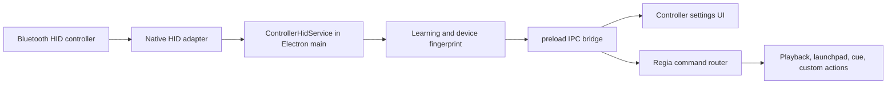

# Controller HID Esclusivo Con Learning

## Obiettivo
Aggiungere a Regia Video un'integrazione nativa per un controller Bluetooth HID con jog e 4 pulsanti, configurabile dall'app e non trattato come normale mouse/tastiera dal sistema quando possibile. Il controller deve essere appreso esplicitamente dall'utente, evitando che il mouse vero del computer o il trackpad vengano associati per errore.

## Contesto
- L'app e' Electron + React: main process in `electron/main.ts`, preload in `electron/preload.ts`, UI in `src/`.
- Gli input esistenti sono eventi web/tastiera nella finestra e comandi remoti LAN.
- Non esiste ancora un layer HID/Bluetooth nativo, ne' global shortcuts o entitlements macOS dedicati.

## Architettura
Creare un servizio `ControllerHidService` nel main process, separato dalla UI, con adapter OS-specifici o libreria HID nativa.

## Learning Protetto
- Il learning non deve basarsi sul primo evento ricevuto.
- Deve costruire un fingerprint con vendorId, productId, serial/path quando disponibili, usage page/usage, transport, report descriptor e pattern degli input.
- La sequenza guidata minima e': jog destra, jog sinistra, pulsante 1, pulsante 2, pulsante 3, pulsante 4.
- Regia accetta il controller solo se la sequenza arriva dallo stesso endpoint HID.
- Mouse e trackpad devono essere esclusi o marcati come candidati non validi.
- Alla riapertura dell'app, il servizio deve riconnettere solo il device con fingerprint compatibile o chiedere un nuovo learning.

## Fasi
1. Aggiungere diagnostica HID e lista device candidati.
2. Implementare wizard di learning con challenge su jog e 4 pulsanti.
3. Verificare su macOS e Windows se il device puo' essere catturato in modo esclusivo senza muovere il mouse di sistema.
4. Esporre API tramite `electron/preload.ts` e tipi in `electron/types.ts` / `src/electron.d.ts`.
5. Aggiungere UI impostazioni per device, stato learning e mapping azioni.
6. Aggiornare packaging e workflow per build native su macOS e Windows.

## Rischi
- Un device esposto come mouse HID potrebbe non essere bloccabile in modo affidabile da una normale app Electron su tutti gli OS.
- Mouse e trackpad possono generare eventi simili al jog se si ascolta troppo in alto nello stack; il filtro deve validare il device HID sorgente, non solo il movimento.
- Il supporto macOS + Windows richiede test fisici sul controller reale.
