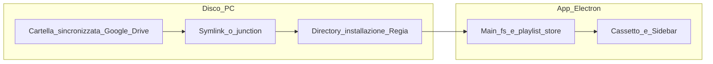

# Piano: cloud = cartella Google Drive sincronizzata + symlink installer

## Nota: piano vs build

- Tutto ciò che è scritto in **questo file di piano** (best practice, decisioni, todo) è **specifica per chi implementa e per QA**: descrive *cosa* fare e *come* validare, **non** è codice eseguito dalla toolchain.
- `npm run build` / electron-builder **non leggono** questo `.md`: le funzioni (readiness, lucchetto, nuvola+modale, ecc.) **appaiono nel prodotto solo dopo** che sono state scritte nel sorgente e mergiate. Il piano serve a non perdere i requisiti tra una sessione e l’altra.

## Cosa hai chiesto (modello operativo)

- I PC target hanno **Google Drive desktop** attivo, account collegato, **privilegi elevati** dove serve (symlink/junction).
- Tutto il materiale “cloud” vive in una **cartella reale sul disco** (sincronizzata da Drive), non necessariamente tramite API Google nell’app.
- Struttura tipo:
  - Radice sul Drive sincronizzato: **`Regia Video`** (costante in codice, installer e documentazione).
  - **`Regia Video/Playlist`**: definizioni playlist (LaunchPad “EFFETTI”, playlist “Ambiente”, “Summer26”, …).
  - **Altre sottocartelle sotto `Regia Video`** (es. **`Suoni`**, **`Musica`**, …): file sorgente usati da Launchpad, playlist a elenco, ecc.
- **Installer**: crea **alias** (macOS: symlink; Windows: junction o symlink — in base a policy e permessi) **dall’installazione** verso la cartella su Google Drive, così l’app (e il filesystem) vedono i file **come se** fossero sotto il programma, ma restano fisicamente sulla copia sincronizzata.
- Esempi:
  - LaunchPad **EFFETTI**: metadati/definizione in **`Regia Video/Playlist`**, campioni in **`Regia Video/Suoni`**.
  - Playlist **Ambiente** / **Summer26**: brani in **`Regia Video/Musica`**, definizioni in **`Regia Video/Playlist`**.

Questo approccio **sostituisce come percorso principale** il piano precedente basato su **OAuth + Drive REST + ZIP** (resta opzionale solo per macchine senza client Drive o per backup espliciti).

## Obiettivo prodotto: progetti portabili in cloud

- **Confermato** (discussione ref. `8b9e6e20-f5f5-468e-b6de-f008ca3e5a63`): l’esito desiderato è lo stesso concetto dei **progetti su volume condiviso** in montaggio (es. Avid/Resolve su NAS/SAN): **un bundle logico** — qui la cartella sincronizzata **`Regia Video`** con **`Playlist`** (definizioni) più **`Musica`**, **`Suoni`**, **`Chalkboard`**, … (media e asset) — che su **ogni postazione** con Drive aziendale + symlink installer si **risolve** alla stessa struttura e mostra **lo stesso show** senza ricostruire i collegamenti a mano.
- La portabilità è garantita da **percorsi relativi alla radice cloud** nel JSON, **sync Drive**, e da **readiness** che verifica che tutto sia risolvibile prima dell’uso in regia.

## Flusso operativo (admin → altro computer)

1. **Admin** copia o incolla i file media nelle **cartelle corrette su Drive** (es. `…/Suoni`, `…/Musica`), come da convenzione del progetto; Drive li sincronizza sui PC collegati allo stesso account (o condivisi, se usate cartelle condivise).
2. Sulla **prima macchina**, in Regia: crea una **playlist** o un **Launchpad**, assegna i brani/campioni **dai path sotto la radice cloud** (Musica/Suoni/…), poi **salva la playlist in cloud** — l’app scrive la definizione in **`…/Playlist`** (un file per playlist o equivalente versionato).
3. Drive sincronizza il file in `Playlist` e i media già presenti nelle altre cartelle.
4. Sul **secondo computer** (stessa struttura installazione + symlink verso la stessa gerarchia **`Regia Video`** su Drive): l’utente **apre il Launchpad / la playlist salvata in cloud** dal cassetto o dall’elenco cloud; l’app **risolve i path** rispetto alla radice cloud di quel PC e tutto risulta **pronto** senza re-import manuale dei file.

Requisito implicito: i riferimenti nel file salvato in `Playlist` devono essere **portabili** (percorsi relativi alla radice cloud o nomi logici + risoluzione), non solo assoluti tipo `C:\Users\Alice\…`, altrimenti il secondo PC non trova i file.

## Best practice (allineate al modello)

1. **Percorsi portabili** — Nei file sotto `Regia Video/Playlist` usare **percorsi relativi alla radice `Regia Video`** (o a sottocartelle note: `Musica`, `Suoni`, …), risolti a runtime con `path.join(cloudRoot, …)`. Evitare di serializzare assoluti legati a un solo utente o disco (`C:\Users\…`, `/Users/…`) se devono aprirsi su un altro PC.
2. **Symlink e junction** — Documentare per gli installatori: **Google Drive desktop** installato, account attivo e **cartella `Regia Video` già presente o creata** prima o subito dopo l’installazione Regia; poi eseguire l’installer che crea symlink/junction. Su Windows indicare chiaramente **junction vs symlink** e i permessi (Developer Mode, elevazione, policy aziendale).
3. **Contratto unico di cartella** — Radice **`Regia Video`** come costante in codice, installer e manuale admin; sottocartelle (`Playlist`, `Musica`, `Suoni`, …) come elenco documentato così admin e regia non divergono.
4. **Versione schema salvataggio** — Includere nel JSON un campo **`schemaVersion`** (es. `1`) per poter migrare i file in `Playlist` in futuro senza rompere macchine vecchie.
5. **Sync e conflitti** — Se due postazioni modificano lo stesso file in `Playlist`, Drive può creare **copie conflitto**: definire regola prodotto (es. ultimo salvataggio vince, avviso in app, naming con data/revisione nei file esportati) e comunicarla agli operatori.
6. **Validazione all’apertura** — Controllare che **tutti i file referenziati esistano** sotto la radice risolta; messaggio elenco “mancanti” se Drive non ha finito la sync o symlink rotto.
7. **Chalkboard in cloud (Opzione A, confermata)** — Con **«Salva in cloud»** (icona nuvola): **copiare i PNG dei banchi** sotto una sottocartella di **`Regia Video`** (es. `Regia Video/Chalkboard/<id-o-nome>/` o convenzione unica documentata) e nel JSON in **`Regia Video/Playlist`** serializzare **solo percorsi relativi alla radice `Regia Video`** verso quei PNG. **Non** lasciare i soli path in `userData` se si pretende portabilità cross-PC.
8. **Sicurezza repository** — Non committare chiavi Google (es. service account JSON) nel codice; anche se il flusso principale è filesystem, i segreti restano fuori dal repo e dalla build pubblica.
9. **Readiness / health check** — Prima di andare in aria, la app (o una voce di menu dedicata) deve poter rispondere in modo chiaro: **«tutto risolvibile»** (tutti i media e le definizioni cloud accessibili) **vs «mancano N file»** (elenco nominativo), così l’operatore non scopre i buchi in diretta.
10. **Versioning / nome file in `Playlist`** — Nei file salvati in `Regia Video/Playlist`, prevedere **data o revisione nel nome file** (es. `Summer26_2026-04-19_rev2.regia.json`) per **rollback rapido** e minor rischio sovrascritture silenziose; in combinazione con `schemaVersion` nel JSON.
11. **Anti-modifica accidentale (lucchetto)** — In alto su **playlist / launchpad / chalkboard** (pannello floating o equivalente), un controllo **lucchetto** (locked/unlocked): con **lucchetto chiuso**, disabilitare drag-drop, rimozioni, rinomina e salvataggi strutturali (o richiedere sblocco esplicito). **Sufficiente** come alternativa leggera a una modalità complessa “solo lettura cloud” separata; opzionale in futuro etichetta “origine: cloud” ma il vincolo operativo è il lock.
12. **Documentazione** — **Sì**: oltre alla pagina **admin** (Musica vs Suoni, esempi EFFETTI / Summer26, struttura `Regia Video`, ordine install), un **manuale utente** per operatori in regia (aprire da cloud, SALVA vs nuvola, lucchetto, readiness, wizard riparazione). I due manuali possono essere lo stesso documento in sezioni o due PDF/HTML distribuiti con l’installer.

## Decisioni prodotto confermate

- **Progetti portabili in cloud** — Requisito di prodotto **esplicito** (non solo implicazione tecnica): il modello `Regia Video` + `Playlist` + cartelle media/asset è il **progetto portabile** distribuito via Google Drive tra le postazioni aziendali.
- **Solo ambiente aziendale** — Non si prevede account Google Drive **personale** su questi PC: macchine **aziendali** con Drive gestito dall’organizzazione. Non serve quindi UI per scegliere tra “personale vs aziendale”; resta comunque possibile che **IT cambi mount** o percorso sync (aggiornamenti client, policy): il **wizard di riparazione** copre quel caso, non la coesistenza di due account Drive sullo stesso profilo.
- **Wizard «Ripara collegamento»** — **Sì, previsto obbligatoriamente**: se all’avvio o all’uso la app **non trova** la radice configurata, symlink rotti, o `Regia Video` non leggibile, mostrare un flusso guidato (cartella Drive / percorso `Regia Video`, test lettura, salvataggio config — es. [`SettingsModal.tsx`](src/components/SettingsModal.tsx) o modale dedicata) prima di fallire in silenzio.
- **Permessi file su Drive** — Non è richiesta al piano una verifica legale dei diritti; **assunzione operativa**: sui PC già in uso i file su Drive sono scritti/letti da **un’altra app con successo**, quindi lo stesso contesto utente/ACL aziendale dovrebbe consentire a Regia di creare/aggiornare file in `Regia Video` **salvo** policy IT future (da monitorare in rollout).
- **Salvataggio locale vs cloud (flusso operatore)** — Si apre una **playlist cloud**; si modifica. Due azioni distinte: pulsante **SALVA** (o equivalente esistente) = persistenza **locale** (`userData` / store salvati sulla macchina). Pulsantino **icona nuvola** = scrittura/aggiornamento su **`Regia Video/Playlist`**, preceduto da **modale di conferma** (testo chiaro: sovrascrive il file cloud condiviso, ecc.). **Nessuna** doppia scrittura automatica nascosta: l’operatore sceglie quando propagare in cloud.

## Implicazioni tecniche

### Percorsi nelle playlist (oggi)

In [`electron/main.ts`](electron/main.ts) le playlist usano **percorsi assoluti** (`paths`, `launchPadCells[].samplePath`, chalkboard PNG). Con symlink coerenti, quei path possono puntare già sotto la radice Drive (risolti dal OS). Non serve un “download” se i file sono sempre locali e sincronizzati.

### Decisioni di ingegneria (da fissare in implementazione)

1. **Single source of truth per i salvataggi “in cloud”**
   - Il flusso admin descrive **`…/Playlist` come destinazione ufficiale** del comando **«Salva in cloud»** (non solo export manuale).
   - **Store locale `userData`**: può restare per playlist di lavoro / non cloud; le voci “cloud” sono file in `…/Playlist` letti dal cassetto e apribili cross-PC. In alternativa (fase 2): mirror bidirezionale con lo store locale — la v1 può privilegiare **file in `Playlist` + apertura diretta** per minimizzare drift.
   - Il cassetto “cloud” in basso elenca **`fs.readdir` su `…/Playlist`** (IPC es. `cloud:listPlaylistFolder`), doppio clic = caricamento come oggi `loadSavedPlaylist` ma da quel file (con risoluzione path).

2. **Azioni salvataggio** — **SALVA**: come oggi, store locale. **Icona nuvola (salva in cloud)**: serializza (con chalkboard: copia PNG sotto `Regia Video` + relativi nel JSON), nome file in `Regia Video/Playlist` con **data/revisione** dove applicabile, poi **modale di conferma** prima di scrivere sul path cloud condiviso.

3. **Rilevamento percorso Google Drive** (installer / primo avvio)
   - Windows: variabile per utente (`%USERPROFILE%`, unità `G:` File Stream, ecc.).
   - macOS: `~/Library/CloudStorage/GoogleDrive-*` vs `~/Google Drive`.
   - Strategia: **percorso scelto in installer** o file di config (`regia-cloud-root.txt`) generato dall’installer accanto all’app, letto dal main all’avvio.

### Installer (electron-builder / script dedicato)

- Creare sotto la directory di installazione (o `userData`) una struttura fissa, es. `Resources/RegiaCloud` → **symlink** a `<DriveSynced>/Regia Video`.
- Eventualmente symlink multipli: `…/RegiaCloud/Playlist` → `…/Regia Video/Playlist`, `…/RegiaCloud/Musica` → `…/Regia Video/Musica`, così l’app usa path stabili relativi all’installazione.
- Documentare: ordine operazioni (**installa Drive**, accedi, **poi** installa Regia o riesegui “repair” symlink se Drive cambia mount).
- **Permessi**: su Windows i symlink spesso richiedono **Developer Mode** o **SeCreateSymbolicLinkPrivilege**; con “privilegi elevati” l’installer può creare **junction** verso cartelle (senza symlink per file singoli) dove i symlink non sono ammessi.

## UI (invariato nell’intento, cambia l’implementazione)

- **Lucchetto** in header playlist / launchpad / chalkboard (vedi best practice §11).
- Voce o pannello **Readiness** (health check) coerente con best practice §9.
- Cassetto **espandibile in basso** (chevron stile Mail) nel tab PLAYLIST in [`SidebarTabsPanel.tsx`](src/components/SidebarTabsPanel.tsx).
- Contenuto: elenco elementi trovati in **`…/Playlist`** (file manifest / json / zip interno — formato da allineare alla scelta store sopra), icone tracks / launchpad / chalkboard come in [`SavedPlaylistsPanel.tsx`](src/components/SavedPlaylistsPanel.tsx).
- **Drag and drop**: operazioni su **file** (copia file in/out della cartella Playlist, o import che riscrive path verso `RegiaCloud/Musica` / `Suoni`), non `drive.fileId` REST. **Copia vs sposta**: tasto modificatore (es. Alt) + `effectAllowed` / `dropEffect`.
- Reorder lista locale: resta separato (MIME dedicato o prefisso) per non confliggere con drag “cloud file”.

## Mermaid (flusso dati aggiornato)

## Cosa rimandare (piano precedente)

- **OAuth + Google Drive API + upload ZIP**: non necessario per la distribuzione descritta; eventuale fase 2 se servono PC senza client Drive.

## Aspetti aggiuntivi da considerare o valutare

### Decisioni questionario (una riga per risposta assunta)

1. **Drive “solo online”** — **C** (confermato operatore): readiness segnala file non locali + guida “disponibile offline”; la app esegue **retry periodico** a intervalli per un **tempo massimo** prima di dichiarare fallimento.
2. **Latenza e I/O** — **C**: spinner + timeout chiari + messaggio se supera N secondi; in più testo esplicito **“operazione su cartella Drive in corso…”** (senza integrare API Drive native oltre il filesystem).
3. **Percorsi lunghi e Unicode** — **C** (confermato operatore): manuale admin + **warning in app** se path oltre soglia sicura + **checklist IT** / indicazioni nel wizard riparazione per **long path** a livello OS dove applicabile.
4. **Lock file / EBUSY** — **B**: messaggio **chiaro in italiano** (file in uso, chiudi l’altra applicazione) + pulsante **Riprova**; niente retry automatico in background.
5. **Antivirus / Controlled Folder Access** — **B**: nota manuale rollout + **FAQ / troubleshooting statico** in Impostazioni; nessun rilevamento euristico dedicato in v1.
6. **Spazio disco** — **B**: la **readiness** (e/o il flusso salva cloud) mostra un **avviso** se lo spazio libero è sotto una soglia configurabile (es. 5–10%); nessun blocco duro in v1.
7. **Cronologia versioni Drive** — **C**: paragrafo nel **manuale utente** + nel **modale di conferma** salva cloud un richiamo che le versioni precedenti si possono recuperare dalla cronologia Drive (procedura web).
8. **Integrità hash (SHA-256)** — **B**: **non in prima release**; previsto in **roadmap fase 2** (opzionale valutare opzione on/off al salvataggio in quel momento).
9. **Sicurezza / privacy / log** — **C**: **nessuna telemetria** in v1 + regola **no segreti nei JSON**; in più **paragrafo privacy** nel manuale (chi accede alla cartella `Regia Video` aziendale, uso condiviso).
10. **Aggiornamenti app / migrazione** — **C**: l’app **legge** `schemaVersion` (e layout) vecchi e **converte automaticamente** quando l’utente salva di nuovo; se il file è **troppo vecchio o non supportato**, **avviso** bloccante o guidato con istruzioni (nessuna conversione silenziosa rischiosa senza feedback).
11. **Più utenti Windows** — **B**: path radice cloud / config **per profilo utente** (sotto `userData` legato all’utente OS); nessun prompt obbligatorio extra al primo avvio oltre al wizard riparazione se serve.
12. **Backup oltre Drive** — **C**: **manuale admin** con raccomandazione backup NAS / policy aziendale sulla cartella `Regia Video` + in app una voce **“Esporta zip progetto”** (opzionale, on-demand).

- **Drive “solo online” / file non scaricati** — Se il client marca file solo in cloud senza copia locale, la readiness e l’apertura falliscono finché non si forza “disponibile offline” o si scarica; documentare per IT/operatori.
- **Latenza e I/O** — Prime aperture dopo sync o cartelle molto grandi: possibile lentezza; valutare indicatore “sync in corso” o timeout chiari in lettura elenco `Playlist`.
- **Percorsi lunghi e Unicode** — Windows ha storia di **MAX_PATH** e caratteri speciali; nomi file in `Playlist` e sottocartelle `Musica`/`Suoni` meglio se **ASCII brevi** in documentazione admin, o abilitare long path a livello OS/policy.
- **Lock file tra processi** — Se un altro tool tiene aperto un file in scrittura, Regia può ricevere `EBUSY`; messaggio d’errore actionable (“chiudi l’altra app” / riprova).
- **Antivirus / Controlled Folder Access** — Su Windows, esclusioni o false positive su `.exe` in `Program Files` + scansione file su Drive possono rallentare o bloccare scritture; nota per rollout IT.
- **Spazio disco** — Drive in mirror locale su SSD piccoli: rischio disco pieno; readiness potrebbe includere **spazio libero minimo** opzionale.
- **Versioning Drive lato Google** — Oltre al naming con data/revisione nei file, valutare se gli operatori devono usare **cronologia versioni** Drive come rete di sicurezza (procedura manuale in manuale utente).
- **Integrità opzionale** — Hash (es. SHA-256) dei file media nel JSON per rilevare **file alterati o corrotti** dopo sync (costo CPU I/O; fase 2 se serve).
- **Sicurezza e privacy** — Cartella aziendale condivisa: chi può leggere cosa; niente credenziali nei JSON; log di crash senza path completi in telemetria se un giorno si aggiunge.
- **Aggiornamenti app** — Nuova versione che cambia `schemaVersion` o layout: policy di **migrazione** file in `Playlist` esistenti e compatibilità all’indietro per una o due major.
- **Stesso PC, più utenti Windows** — Profili diversi = symlink/config per utente; chiarire se le postazioni sono **sempre lo stesso profilo** o se serve config per profilo.
- **Backup oltre Drive** — Disaster recovery: export zip opzionale o backup NAS aziendale della cartella `Regia Video` (fuori scope app, ma da menzionare al cliente).

## Rischi

- **Percorso Drive che cambia** (aggiornamento client Google, migrazione IT, cartella spostata): anche con **solo account aziendale**, il mount o il path locale può cambiare → symlink rotti o radice errata → mitigazione: **wizard «Ripara collegamento»** (requisito confermato) + file di config aggiornabile senza reinstallare tutta l’app se possibile.
- **Conflitti sync**: due macchine che modificano lo stesso file in `Playlist` nello stesso istante — mitigazione: nomi file per playlist, ultima modifica vince, o lock documentato.
- **Path assoluti legacy**: playlist già salvate solo in `userData` con path locali vanno **re-esportate in cloud** dopo aver messo i file sotto `Musica`/`Suoni` e aver riassegnato i media, oppure uno strumento di migrazione che riscrive in relativi.
