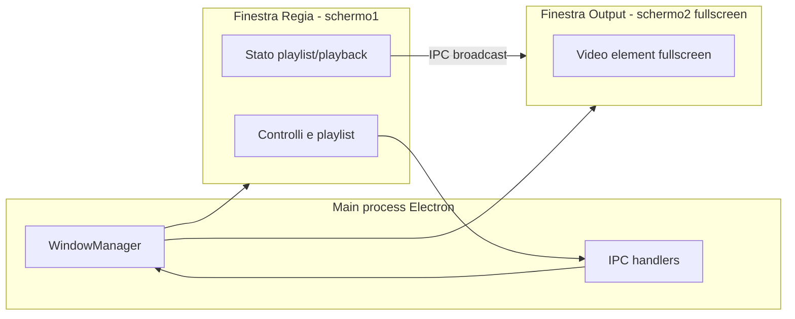

# Regia audio/video a due schermi

## Contesto

La cartella del workspace è vuota: si parte da zero. L’obiettivo è un’app **desktop** con **due finestre** (regia + output), non un singolo browser tab, perché servono posizionamento su **secondo monitor**, **fullscreen affidabile** e scelta **cartella intera** come playlist.

## Stack consigliato

| Esigenza | Scelta |
|----------|--------|
| Due finestre, secondo schermo, fullscreen | **Electron** (API `screen`, `BrowserWindow`, `setFullScreen`) |
| UI moderna e rapida da iterare | **React 18** + **TypeScript** + **Vite** |
| Styling coerente e “pro” | **CSS** (variabili, pochi token colore) opzionale **Tailwind** se preferisci utility-first |

**Alternativa più leggera:** [Tauri](https://tauri.app/) + React (stesso modello a due finestre, dialog nativi). Richiede toolchain Rust; Electron è spesso più veloce da far partire per un MVP AV.

**Non consigliato come solo web:** `window.open` + Fullscreen API su secondo schermo è fragile tra browser e permessi; la cartella come playlist è meglio con API desktop (`dialog` o `showDirectoryPicker` limitato al contesto sicuro).

## Architettura

- **Main process:** crea la finestra regia; rileva display con `screen.getAllDisplays()`; crea la finestra output sul display **non primario** (o quello selezionato dall’utente se c’è un solo monitor, fallback: stesso schermo in finestra dedicata).
- **Comunicazione:** IPC (`ipcMain` / `preload` sicuro con `contextBridge`) per comandi: `loadFile`, `play`, `pause`, `seek`, `setMuted`, `setLoop`, `setPlaylist`, `goNext`. L’output è un renderer **passivo** che riceve URL/path e stato; la regia è l’unica fonte di verità (o uno store condiviso via messaggi).

## Funzionalità richieste (mapping tecnico)

1. **Playlist floating (regia)**  
   Pannello **draggabile** (es. `react-draggable` o pointer events manuali), z-index alto, ombra leggera, bordo sottile. Può essere collassabile (icona) per non coprire i controlli.

2. **Browser cartella → playlist intera**  
   `dialog.showOpenDialog({ properties: ['openDirectory'] })` nel main, preload espone `selectFolder()`. Il main (o il renderer dopo IPC) legge i file nella cartella con estensioni video/audio consentite (whitelist: `.mp4`, `.webm`, `.mov`, `.m4v`, `.mp3`, `.wav`, …), ordine naturale per nome (opzione ordinamento in seguito).

3. **Mute**  
   Toggle su `<video>` nell’output (e indicatore in regia); stato sincronizzato via IPC.

4. **Loop 1 file / Loop playlist**  
   Due modalità mutuamente esclusive o combinate in UX chiara:  
   - `loop === 'one'`: `video.loop = true` (o riavvio manuale su `ended` se servono transizioni).  
   - `loop === 'all'`: su `ended`, passa al track successivo; dall’ultimo torna al primo.  
   - `loop === 'off'`: a fine file si ferma o passa al successivo senza ripetere playlist (scegliere un default esplicito in UI, es. “stop a fine playlist”).

5. **Doppio click su elemento → play**  
   Lista playlist: `onDoubleClick` imposta `currentIndex`, invia `loadAndPlay` all’output.

6. **Barra spaziatrice play/pause**  
   `window.addEventListener('keydown', …)` in regia con **guardia focus**: non intercettare spazio se l’utente sta scrivendo in un `input` (contentEditable / textarea). `preventDefault` solo quando appropriato.

7. **Presenter USB “avanti”**  
   I telecomandi inviano spesso **PageDown**, **Right**, **N** (Keynote), a volte **F5**. Piano:  
   - ascolto `keydown` in regia (focus globale sulla finestra);  
   - mappa default: `PageDown`, `ArrowRight`, `N` → **prossimo elemento playlist** (o “avanti” nel senso di next slide = next file);  
   - opzionale in seguito: pannello “Scorciatoie” per rimappare.

## UI/UX (semplice, elegante, “da regia”)

Ispirazione pratica (senza copiare marchi): **OBS** (chiarezza pannelli), **vMix** (enfasi su stato ON/OFF), **Resolume** (dark UI, contrasto). Best practice:

- **Dark neutro** (grigio 900–950), **un accento** (es. blu o ambra) solo per stato attivo e CTA.
- **Tipografia:** un sans geometrico leggibile (es. system stack o **Inter**).
- **Controlli grandi** per mute e loop (toggle visibili, stato con colore/icona).
- **Playlist:** righe alte, nome file troncato con tooltip, **riga selezionata** e **file in onda** distinti.
- Ridurre rumore: niente gradienti pesanti; molto spazio bianco interno ai pannelli.

Layout regia (schermo 1): area centrale **preview opzionale** (stesso stream dell’output in scala ridotta, utile per controllo) + barra trasporti (play/pause, indicatore tempo) + pannelli laterali o bassi per cartella e modalità loop.

## Struttura progetto (indicativa)

- `electron/main.ts` — bootstrap, creazione finestre, posizionamento display, menu minimale.
- `electron/preload.ts` — API esposte: `selectFolder`, `getDisplays`, `moveOutputToDisplay`, `onOutputCommand`.
- `src/App.tsx` — shell regia.
- `src/components/FloatingPlaylist.tsx`
- `src/components/TransportBar.tsx`
- `src/components/OutputApp.tsx` — entry seconda finestra (build separata o stesso bundle con route/hash `?window=output`).
- `src/hooks/useKeyboardShortcuts.ts`
- `src/state/store.ts` — stato playlist (lista `File` come `file://` URL da path sicuri).

**Nota sicurezza Electron:** `nodeIntegration: false`, `contextIsolation: true`, nessun `remote`; solo path validati lato main per `file://`.

## Rischi e note

- **Codec:** Chromium in Electron riproduce i formati supportati da Chrome; file ProRes/alcuni `.mov` possono non andare — documentare formati consigliati o prevedere in futuro FFmpeg (fuori scope MVP).
- **macOS:** permessi cartelle e fullscreen su secondo schermo vanno testati su macOS 14/15; eventuali quirk su `setFullScreen` vs `simpleFullscreen`.

## Ordine di implementazione

1. Scaffold Electron + Vite + React + TS; seconda finestra output con `<video>` fullscreen.
2. IPC: comandi base play/pause/load; sync mute.
3. Dialog cartella + scansione file + lista playlist + doppio click.
4. Loop singolo / playlist; comportamento `ended`.
5. Shortcut spazio + presenter (PageDown/Right/N).
6. Floating playlist + rifinitura UI (tema, spacing, stati focus).
