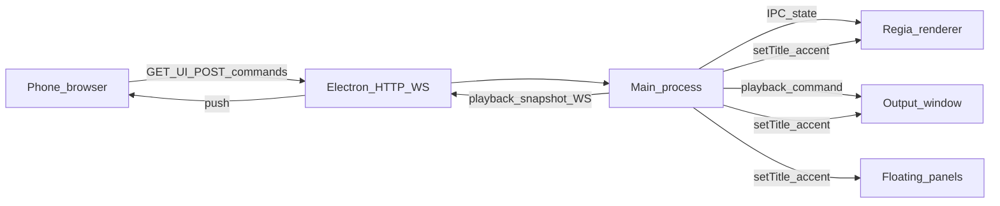

# Telecomando smartphone + QR per launchpad

## Telecomando = primo plugin

Sì: il concetto **plugin** può partire già da qui. In pratica il telecomando non è “logica speciale” nel main accanto al server: è il **primo modulo** che implementa il contratto host (es. `id: "remote"`, `mountHttpRoutes`, `registerWebSocketHandlers` o equivalente) e che il core **carica e registra** quando l’utente attiva il server LAN.

- **Host (core)**: porta configurabile, bind LAN, emissione token, avvio/stop server, smistamento richieste verso i plugin registrati, envelope WS con `channel` per sapere quale plugin gestisce il messaggio.
- **Plugin `remote` (telecomando)**: static SPA sotto `/remote/`, API sotto `/api/remote/v1`, messaggi WS con `channel: "remote"`; tutta la semantica playlist/launchpad/playback resta confinata in questo modulo + adattatori verso IPC già esistenti.
- **Vantaggio**: il piano [plugin/Quiz](./architettura_plugin_e_quiz_45e9d4e8.plan.md) diventa il **secondo** plugin (`quiz`) che monta `/quiz/` e `channel: "quiz"` sullo stesso server, senza ridefinire il trasporto.

Non è obbligatorio pubblicare subito `regia-plugin-remote` come package npm separato: può restare cartella `plugins/remote` nel monorepo finché l’API si stabilizza; l’importante è che **il confine di responsabilità** sia quello di un plugin fin dal primo commit del server LAN.

---

## Contesto nel tuo progetto

- I launchpad sono **playlist salvate** con `playlistMode: 'launchpad'` e celle in `launchPadCells`; l’elenco e il caricamento passano da IPC (`playlists:list`, `playlists:load`/handler equivalenti in `[electron/main.ts](electron/main.ts)`).
- La riproduzione verso l’uscita è già un **canale unico**: `ipcMain.handle('playback:send', …)` normalizza `load` e chiama `forwardToOutput`, che invia `playback:command` alla finestra output (`[electron/main.ts](electron/main.ts)` intorno a `playback:send`).

Non c’è oggi un **server HTTP/WebSocket** nell’app: il telefono non può parlare con la regia senza aggiungere qualcosa (o usare un bridge esterno).

---

## Opzioni (da “più integrata” a “più generica”)

### A) Mini server LAN dentro Electron (consigliata se vuoi tutto in Regia Video)

- Il **main process** avvia (su richiesta, es. toggle in Impostazioni) un **unico** server HTTP leggero sulla LAN (`0.0.0.0` + porta configurabile, firewall permettendo) e delega le rotte al **plugin telecomando** (`remote`) come descritto sopra.
- **Pagina web** dedicata (HTML/React build separata o route Vite): vedi sotto **Interfaccia a schede**; dati sempre da `playlists:list` / dettaglio salvato, filtrati per `playlistMode`.
- **Azioni**: stessi effetti della UI desktop — es. slot → stessa logica di `loadLaunchPadSlotAndPlay` (oggi nel renderer): va **esposta o duplicata in main** (handler IPC riusabile o funzione condivisa) così il telefono non manipola path direttamente; per transport usare la stessa catena di `PlaybackCommand` già usata da `[electron/preload.ts](electron/preload.ts)` (`sendPlayback`).
- **QR code**: contiene un URL **sotto prefisso dedicato al telecomando**, es. `http://<IP-LAN>:<porta>/remote/?token=…` (evita di occupare `/` come unica SPA: lascia spazio a `/quiz?token=…` e ad altre superfici sullo stesso server). Token generato a sessione o da preferenze. Pagina solo LAN. **Dove lo vedi sulla regia**: vedi sezione sotto (oggi l’app non ha ancora questa UI).
- **Pro**: un solo dispositivo (Mac/PC con la regia), UX coerente, nessun servizio cloud.
- **Contro**: da progettare **autenticazione** (token), **HTTPS** opzionale (su LAN spesso si accetta HTTP + token corto), binding rete e messaggi chiari se il firewall blocca.

### B) App companion separata (Node/Python) sulla stessa macchina

- Stesso schema di A ma il server è un processo esterno che chiama l’app via **IPC non ufficiale** o file/socket — più fragile; utile solo se vuoi isolare dipendenze.

### C) Strumenti da regia / automazione (Companion, OSC, Shortcuts)

- **Bitfocus Companion**, **OSC**/MIDI, **HTTP** da Automator/Shortcuts: ottimo per **play/pause/next** o macro, meno naturale per **griglia launchpad fedele** ai pad salvati senza molto lavoro di mapping manuale.
- **Pro**: veloce per comandi semplici.
- **Contro**: non “vedi” automaticamente i launchpad del progetto come in A.

### D) Solo PWA “ospitata” altrove

- Hosting su Internet + tunnel (ngrok, Cloudflare Tunnel): il telefono funziona ovunque ma **esponi la regia su Internet** — solo con tunnel autenticato e forse non accettabile per uso live senza hardening.

---

## Interfaccia telecomando: schede (playlist vs launchpad)

Il telecomando può essere organizzato in **due schede** che riusano lo stesso modello dati già presente nello store (`playlistMode: 'tracks' | 'launchpad'` da `playlists:list`):

- **Scheda Playlist**: elenco delle sole voci con `playlistMode === 'tracks'` (etichetta, conteggio brani, colore tema se utile). Tap → carica quella playlist salvata; vista dettaglio con **lista brani** e tap su riga per caricare/riprodurre la traccia (stesso flusso di `loadIndexAndPlay` / caricamento playlist nel renderer, da esporre o replicare in main per il canale remoto).
- **Scheda Launchpad**: elenco delle sole voci con `playlistMode === 'launchpad'`. Tap → **griglia pad** (nome, colore, eventuale stato); tap su slot → stessa semantica di `loadLaunchPadSlotAndPlay`.

**Navigazione suggerita**: **schede in alto** (Playlist | Launchpad) → area centrale scrollabile (lista per scheda, oppure dettaglio dopo tap) → **barra transport sempre in basso** su ogni scheda e su ogni vista (liste, dettaglio brani, griglia launchpad): play/pause, prev/next, volume — stesso comportamento ovunque, senza legare i controlli a una playlist specifica (agiscono sul transport globale già gestito da `PlaybackCommand` / stato regia).

Questo evita di mescolare due paradigmi UI nella stessa lista e allinea il telecomando a come la regia già distingue salvataggi in `[electron/preload.ts](electron/preload.ts)` (`playlistMode` in `playlists:list`).

---

## Dove vedere il QR (e il link) nella regia desktop

**Stato attuale**: la funzione non è ancora implementata; **in app non c’è** un QR finché non viene aggiunto il server LAN e questa UI.

**Comportamento previsto dopo l’implementazione** (da fissare nel codice, tipicamente in `[src/components/SettingsModal.tsx](src/components/SettingsModal.tsx)` o sottosezione dedicata):

- Apri **Impostazioni** dalla finestra principale della regia.
- Sezione **“Telecomando” / “Rete LAN”** (nome finale da definire): interruttore **Avvia / Ferma server**.
- Con il server **acceso**: mostra **indirizzo IP locale + porta**, **URL completo** del telecomando (stesso valore codificato nel QR), **immagine QR** scansionabile dal telefono (stessa rete Wi‑Fi), pulsante **Copia link** per incollarlo in un browser senza scanner.
- Con il server **spento**: QR e link nascosti o disabilitati, messaggio breve (“Attiva il server per generare il QR”).
- Opzionale in seguito: icona nella barra titolo / menu **Apri telecomando** che apre solo l’URL nel browser del Mac (utile per debug); il QR resta comunque il caso d’uso principale per lo smartphone.

Il QR **non** va mostrato sulla finestra Output (schermo pubblico): resta solo nella UI di controllo / Impostazioni.

---

## Scelta consigliata per il tuo obiettivo (“launchpad a scelta tra gli esistenti” + telecomando)

**Opzione A**: server LAN opzionale in Electron + **host plugin minimale** + **primo plugin `remote`** (pagina remota + token QR), riusando lo store playlist e la pipeline `PlaybackCommand` / logica slot già presenti nel codice, con **UI a schede** Playlist / Launchpad come sopra.

**Stato in onda sul telefono (obbligatorio, non opzionale)**: titolo (o nome pad / etichetta sintetica), **tempo** (posizione / durata se note), **pad attivo** in launchpad, **playing vs pausa**, coerenza con la transport bar. Il **main** mantiene (o ricostruisce da eventi già noti) un **snapshot serializzabile** e lo spinge ai client remoti via **WebSocket** sul channel `remote` (fallback **polling** breve se WS non disponibile). Vedi anche la sezione successiva per l’allineamento con le **finestre desktop**.

**Transport**: non è una terza scheda; è la **barra inferiore fissa** (tipi in `[electron/types.ts](electron/types.ts)`) sempre visibile mentre si naviga tra le due schede e i dettagli.

---

## Stato in onda e indicatore “audio attivo” sulle finestre (stile Chrome)

### Telefono

Già coperto sopra: area compatta sopra o integrata con la transport bar (testo ellissato per titolo lungo, tempo monospace, highlight pad nella griglia quando si è nel dettaglio launchpad).

### Desktop: come comunicarlo senza affollare la UI

Analogia **Chrome / tab con altoparlante**: l’utente deve capire **quale finestra** sta emettendo audio senza nuove barre strumenti.

**Fonte di verità**: il **main** sa (o riceve dai renderer) *quale* finestra è sorgente dell’audio rilevante: finestra **Output** (program) vs **anteprima** regia vs **pannello floating** (es. launchpad cue). Definire un piccolo contratto `audioActivity: { windowId | role, playing, … }` aggiornato a bassa frequenza (es. su play/pause/seek/load, non ogni frame).

**Opzioni a basso ingombro** (combinabili; partire dalla 1):

1. **Suffisso nel titolo finestra** (`BrowserWindow.setTitle`): aggiungere un solo carattere Unicode stabile quando `playing` e questa finestra è la sorgente attiva, es. `♪` o `▶` prima del titolo base, rimosso quando silenzioso/in pausa. Pro: zero pixel nel layout interno, visibile in **Mission Control / Exposé / elenco finestre** e nella barra titolo quando non è fullscreen. Contro: su **Output fullscreen** spesso la titlebar non si vede — accettabile se l’indicatore serve soprattutto alla regia e ai pannelli flottanti.

2. **Accento perimetrale minimale** (2–3 px) sul bordo superiore del **contenuto** della sola finestra attiva (colore tema o verde tenue), senza nuova toolbar: è percezione “LED” come alcune DAW, non un’icona cliccabile.

3. **Riuso controlli esistenti**: se la finestra ha già un pulsante play nella chrome interna, solo **stato visivo** (icona animata leggerissima o alone) senza aggiungere nuovi widget.

**Da evitare** per non sporcare: icone grandi sempre visibili in ogni angolo, badge numerici, suoni di notifica.

**Finestra Output a schermo intero in sala**: valutare **nessun** accento sul bordo (potrebbe vedersi dal pubblico) e solo titolo quando non fullscreen; oppure indicatore **solo** su finestra regia + floating.

Le finestre sono create in `[electron/main.ts](electron/main.ts)` (`BrowserWindow`): l’aggiornamento titolo è centralizzabile dal main quando cambia lo snapshot playback.

---

## Modifiche opportune per compatibilità futura (Quiz / stesso canale)

Il canale LAN sarà riusato dal **secondo plugin** (pulsantiera **quiz**) sul telefono ([piano plugin/Quiz](./architettura_plugin_e_quiz_45e9d4e8.plan.md)). Conviene fissare fin da subito alcune scelte nel design del **plugin `remote`** e dell’host così non serve rifattorizzare il server dopo.

1. **Un server, più “superfici” HTTP**
  - Static e entrypoint SPA del telecomando sotto un prefisso fisso (`/remote/`, asset con `base` coerente).  
  - Eventuali API REST del telecomando sotto versione esplicita, es. `/api/remote/v1/...`, non handler sparse sulla root.  
  - Il Quiz aggiungerà `/quiz/` e `/api/quiz/v1/...` (o equivalente) senza collisioni.
2. **WebSocket: un endpoint upgrade, messaggi discriminati**
  - Opzione consigliata: **un solo** path WS (es. `/ws`) con **envelope** obbligatorio tipo `{ "v": 1, "channel": "remote" | "quiz", "type": "...", "payload": ... }` dopo autenticazione con lo stesso `token` (o token+capability).  
  - Alternativa: path separati (`/ws/remote`, `/ws/quiz`) ma stesso processo e stessa gestione TLS/token se un giorno servisse.  
  - Evitare di accoppiare il WS solo al DOM del telecomando senza tipo messaggio: il Quiz ha eventi diversi (round, answer, leaderboard) e non deve mescolarsi ai comandi playback.
3. **Token e sessioni**
  - Stesso meccanismo segreto condiviso (header, query o primo messaggio WS) ma prevedere **scopes** opzionali: es. token che abilita solo `channel: remote` vs token sessione quiz (o stesso token con flag lato server quando la sessione quiz è attiva). Così uno scanner di QR “quiz” non ottiene per errore comandi sulla regia musicale.
4. **Versioning protocollo**
  - Campo `v` (intero) su ogni messaggio WS e prefisso `/api/.../v1` permettono evolvere il quiz senza rompere i client telecomando vecchi.
5. **Accoppiamento main ↔ renderer**
  - Tenere nel **main** la logica “cosa fa questo messaggio remoto” (già previsto per playback). Per il telecomando, evitare che la pagina web chiami pattern IPC non riusabili; handler centralizzati nel main diventano il punto in cui in futuro si inoltrano anche eventi quiz verso la finestra output / plugin.
6. **Non dipendere dal fatto che “c’è una sola pagina”**
  - Se oggi servi una sola `index.html`, generalizza a router statico per path (`/remote/index.html`) o build multi-entry Vite, così aggiungere la build `/quiz` non richiede fork del tooling.

In sintesi: **prefissi URL**, **API versionate**, **WS con channel/versione**, **token con scope possibile** — sono le modifiche più utili al piano telecomando per compatibilità con la pulsantiera quiz senza secondo server o breaking change.

---

## Rete, affidabilità WebSocket, stato connessione, messaggi, audio e accessibilità (requisiti telecomando)

Tutti gli elementi seguenti sono **nel perimetro del primo rilascio** del telecomando (tranne dove indicato “wave 2”).

**Rete e discovery**

- **Cambio IP (DHCP)**: rilevare variazioni dell’indirizzo LAN usato dal server; aggiornare **URL, QR e testo** in Impostazioni oppure mostrare messaggio chiaro che l’URL precedente non è più valido finché non si riscansiona il nuovo QR.
- **Firewall macOS**: in documentazione e/o tooltip in Impostazioni, indicazione se il server non è raggiungibile (possibile blocco firewall) e link o istruzioni sintetiche.
- **mDNS / Bonjour**: annunciare un hostname stabile del tipo `regia.local` (nome definitivo da scegliere ed eventualmente configurabile) così il telefono può aprire `http://regia.local:<porta>/remote/…` senza leggere l’IP numerico; il QR può preferire l’hostname quando risolvibile.

**Affidabilità lato client telecomando**

- **Riconnessione WebSocket automatica** con backoff (es. dopo sleep del telefono o micro-interruzioni Wi‑Fi).
- **Coda comandi** in breve finestra offline: comandi tap accumulati e inviati al ripristino WS, con limite di coda e scarto con messaggio se troppo lungo.
- **Rate limiting** lato server (e/o client) per evitare spam di tap su pad o transport.

**Stato connessione in UI (telefono)**

- Indicatore fisso vicino alla **transport bar**: **Online** / **Riconnessione** / **Offline** (testo o icona + etichetta accessibile).

**Messaggi utente chiari (telefono e dove serve desktop)**

- Esempi di copy: **“Server LAN spento sulla regia”**, **“Rete diversa”** (telefono non sulla stessa LAN / host irraggiungibile), **“Token non valido”** / sessione scaduta; evitare errori tecnici crudi come unica uscita.

**Audio e feedback**

- **Nessun suono di sistema invasivo** su ogni azione remota; eventuale **click sonoro leggero** solo se abilitato in preferenze (opzionale, default off).

**Accessibilità da venue**

- **Tema scuro** di default o preferenza; **contrasto** sufficiente per testi e controlli in penombra.
- **Aree touch grandi** (transport, pad, righe lista); **feedback visivo immediato** al tap (stato pressed / alone / breve animazione) anche quando lo stato “in onda” dal server arriva con ritardo di qualche decimo.

**Wave 2 (non sostituisce quanto sopra)**

- Wake Lock, PWA “Aggiungi a schermata home”, ruoli operatore: restano in iterazione successiva (todo `remote-mvp-wave2`).

---

## Cosa può ancora mancare (rispetto a un prodotto “completo”)

Il piano copre architettura, UI a schede, transport, QR, compatibilità Quiz, stato in onda, indicatori finestra, **e la sezione precedente** (rete, WS, connessione, messaggi, audio, accessibilità).

Restano principalmente per iterazioni successive:

- **Gestione sessioni avanzata**: rigenerare token, revocare sessioni, scadenza dopo N ore, più telefoni con policy esplicite.
- **Mobile**: **Wake Lock**, `viewport` / safe-area iOS (già citati altrove; rifinire in wave 2 se non tutti in v1), PWA leggera opzionale.
- **OSS / privacy nei log**: non loggare path file completi verso il client remoto; errori generici lato telefono, dettaglio solo in console regia.
- **Ruoli** (fase avanzata): solo transport vs controllo completo.

---

## Best practice (sintesi operativa)

**Sicurezza**

- Token lungo e non indovinabile; preferire **header** o **primo messaggio WS** oltre alla query (la query finisce nei log server/referrer).
- Valutare **HTTPS** con certificato locale (complessità su iPhone: fiducia certificato) vs HTTP solo LAN accettata con token forte — documentare il rischio (utente malintenzionato sulla stessa Wi‑Fi).
- **CORS** e origine: in LAN limitare se possibile; non esporre API senza token.

**Robustezza**

- **Timeout** idle sulle connessioni WS; heartbeat ping/pong.
- **Idempotenza** dove ha senso (es. doppio tap “play”).
- **Versioning** API/WS (già nel piano) per aggiornare app desktop senza rompere telefoni vecchi.

**UX da venue**

- Rete, connessione, messaggi, audio e accessibilità touch/tema: **requisiti consolidati** nella sezione **«Rete, affidabilità WebSocket, stato connessione…»** più sopra (evita duplicazione con questo elenco).

**Sviluppo**

- Test manuali su **iOS Safari** e **Chrome Android** (comportamenti WS, fullscreen, tastiera che non copre la barra).

---

## Tastiera verso software esterni (es. emulare INVIO)

**Risposta breve**: sì, è **tecnicamente possibile** dalla macchina che esegue REGIA MUSICPRO (processo **Electron main** o helper nativo): si inviano eventi tastiera a livello OS, che finiscono nell’applicazione che ha il **focus tastiera** in quel momento — non necessariamente nella regia.

**Non è la stessa cosa** dei comandi playback del telecomando (che restano confinati in IPC verso la tua app). Qui stai parlando di **iniezione globale** sul desktop: un tap sul telefono → `Enter` (o altro) come se l’utente avesse premuto il tasto fisico.

### Implicazioni

- **Permessi**: su **macOS** servono in genere diritti **Accessibilità** (e talvolta **Input Monitoring**) per l’app che posta gli eventi; su **Windows** servono API tipo **SendInput** (spesso senza prompt extra, ma policy aziendali/antivirus possono intervenire).
- **Sicurezza (critico)**: chiunque sulla LAN con un token valido potrebbe, se questa funzione esiste, mandare **INVIO** mentre un’altra finestra ha il focus (email, terminale, conferme pericolose). Il rischio è **maggiore** del solo controllo playlist. Va trattato come **funzione opzionale**, **spenta di default**, con **scope token** separato (es. capability `osKeys` non inclusa nel QR “solo regia”), **allowlist** di tasti ammessi (es. solo `Space`, `ArrowRight`, `Enter` su richiesta esplicita), **rate limit** severo e, se possibile, **conferma sul desktop** la prima volta o per ogni sessione.
- **Prevedibilità**: “INVIO” va all’app in primo piano; se l’utente non ha portato in primo piano il PowerPoint o il software desiderato, il tasto va altrove. Documentare chiaramente: **portare in focus l’app target** prima di usare il telecomando-tastiera.
- **Implementazione tipica**: modulo nativo o libreria consolidata (es. ecosistemi tipo **nut.js** / binding a **Core Graphics** / **robotjs** — valutare manutenzione e compatibilità Electron); evitare soluzioni fragili basate solo su AppleScript per ogni tasto se serve bassa latenza e tasti arbitrari.

### Rapporto con il plugin `remote`

- Può restare **sotto-feature** del plugin telecomando (tab “Tastiera esterna” / “Hotkey”) o un **sotto-plugin** con mount API dedicato, sempre dietro le stesse garanzie di token.
- **Non** è requisito del **MVP** del telecomando (playlist/launchpad/transport/stato in onda); va in **ondata successiva** con progettazione sicurezza dedicata (todo `remote-os-keyboard-future`).

### Alternative più sicure per casi d’uso specifici

- **Software target con API propria** (OSC, HTTP locale, AppleScript supportato dall’app): preferibile quando esiste, perché non simula tasti ciechi.
- **Bitfocus Companion** / **Stream Deck** / **Shortcuts**: spesso sufficienti per “pagina avanti” o “go” in presentazioni senza esporre tasti globali via LAN.

---

## Funzioni tipiche dei software di riferimento (ispirazione, non obbligo)

Prodotti da regia / playback con controllo remoto o second screen (es. **vMix** web controller, **ProPresenter** / ecosistemi remote, **Resolume**, app dedicate tipo **Mitti**, spesso **QLab** via Companion/OSC) tendono a offrire, oltre ai comandi:

- **Stato sincrono** con la macchina master (play/pause, clip corrente, livello).
- **Interfacce ad alta leggibilità** (grandi pulsanti, layout landscape/portrait).
- **Connessione semplice** (QR, codice sessione, o discovery in rete).
- Talvolta **layout personalizzabili** o più “pagine” di controllo — per te le **schede** + dettaglio coprono il 80%; il resto è optional.
- Talvolta **modalità “solo presentatore”** (poche azioni) — avvicinabile ai **ruoli** sopra.

Il **primo rilascio** del telecomando include anche **rete (IP/firewall/mDNS)**, **affidabilità WS** (riconnessione, coda breve, rate limit), **stato connessione** e **messaggi** chiari, **politica audio** e **accessibilità** da venue, oltre a stato in onda e indicatori sulle finestre. Una **seconda ondata** copre rigenera/revoca token avanzata, wake lock, PWA, ruoli, ecc.

---
