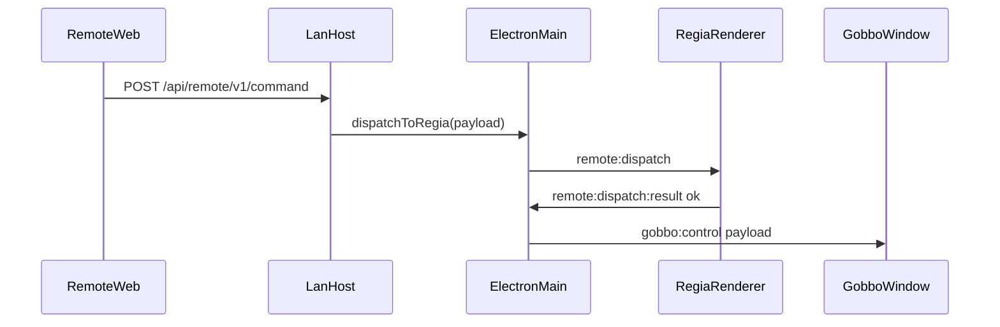
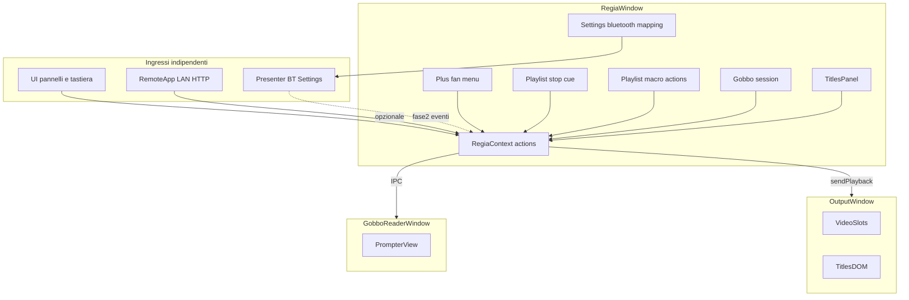

# Piano unico: Titoli, Gobbo, ventaglio «+», playlist (stop/macro), Bluetooth

Questo documento **unifica** due versioni precedenti dello stesso tema (hash nei nomi file). Percorsi **relativi alla root del repo** (es. `src/OutputApp.tsx`).

---

## Contesto tecnico

- **Uscita pubblico**: `src/OutputApp.tsx` compone video + layer immagine (`chalkboardLayer`, `playlistWatermark`). Comandi: `electron/types.ts` / `src/playbackTypes.ts` (`PlaybackCommand`), `playback:send` → `forwardToOutput`.
- **Telecomando LAN**: `electron/lan/remoteTypes.ts` (`RemoteDispatchPayload`); `electron/main.ts` (`dispatchRemotePayloadToRegia`) → `remote:dispatch` sulla finestra regia; gestione in `src/state/RegiaContext.tsx` (es. chalkboard, transport).
- **Titoli vs Gobbo**: i **Titoli** sono overlay sul **PGM** (Schermo 2). Il **Gobbo** è uso separato (testo lungo, scroll): **finestra Electron dedicata** (mirroring opzionale, fullscreen su monitor prompter). Non riusare `titlesLayer` per il Gobbo salvo scelta esplicita (sconsigliato).

**Due canali di controllo distinti**

1. **Telecomando LAN** (HTTP) — esistente; prodotto separato dal Bluetooth.
2. **Presenter Bluetooth** — **nuova** area in **Impostazioni** (learning + mapping); comanda **tutta** la regia (trasporto, playlist, titoli, scroll Gobbo, ecc.); **non** è accoppiato solo al Gobbo e **non** sostituisce la LAN.

Le **azioni interne** (es. `applyGobboScroll`, play/pausa autoscroll) possono essere invocate da UI, tastiera, LAN (se esteso) e tasti Bluetooth mappati: conviene un piccolo strato tipo `dispatchAction(actionId, payload)` per non legare il Gobbo a un solo ingresso.

---

## Parte A — Titoli (overlay PGM)

**Obiettivo**: titoli sul programma con controlli tipo NLE + preset.

**Riferimento funzionale**: Final Cut Text inspector, Premiere Essential Graphics, DaVinci Resolve Text+ (font, peso, corsivo, dimensione, colore, allineamento, interlinea, tracking), riquadro opzionale (sfondo, padding, raggio, opacità), bordo/ombra, ancoraggio (lower third / centro / alto / ticker), **opacità globale**, **motion** base: nessuna, dissolvenza in/out, slide, **crawl**, **roll** (crediti), durata/velocità clampate.

**Modello dati**: modulo versionato (es. `src/lib/regiaTitleDocument.ts`): documento con i campi sopra.

**Trasporto verso Output**: ramo `PlaybackCommand`, es. `titlesLayer: { visible; doc: RegiaTitleDocumentV1; bust?: number }` (preferibile al PNG continuo della lavagna). **Validazione e clamp** in `electron/main.ts` (lunghezza testo, numeri finiti), **ultimo comando memorizzato** + flush su `did-finish-load` come `chalkboardLayer` / `playlistWatermark`.

**Rendering**: componente condiviso (es. `TitleOverlayView` / `TitleOverlayFrame`) in `src/OutputApp.tsx` (layer assoluto, `pointer-events: none`, **z-index** secondo regola prodotto: default **sopra** watermark/lavagna salvo logo programma) e in `src/components/PreviewBlock.tsx` (o layout anteprima programma) quando titolo in onda o anteprima editor.

**UI regia**: pannello (floater / sidebar coerente con `src/App.tsx`, `src/components/SidebarTabsPanel.tsx`): editor, tipografia, aspetto, motion, **galleria preset** (JSON built-in: lower third, ticker, breaking centrato, crediti roll, bug testo).

**Preset Titoli (paradigma Gobbo)**: oltre ai built-in, **libreria utente** con **cartelle/sottocartelle** (navigazione tipo preset plugin Waves). Salvataggio su disco sotto radice dedicata (`userData` o cartella documenti app). Import/export opzionale in seguito.

**Stato**: `RegiaContext` o hook dedicato; `sendPlayback` con **debounce** quando il titolo è **in onda**; bozza in `localStorage` (chiave versionata) oltre ai preset su file.

**Fuori scope iniziale**: testo 3D, curve keyframe complesse, import MOGRT.

---

## Parte B — Gobbo (teleprompter)

**Obiettivo**: incollare testo, font/dimensione/colori/margini, **sfondo** salvato nel bundle, **scroll** da telecomando LAN (opzionale) e da **Bluetooth** (mappato globalmente); finestra comoda per il presentatore.

**Architettura (da allineare in implementazione)**

- Versione **snella** (solo Gobbo + IPC): documento in cartelle `userData` (manifest + `background.*` copiato), finestra `gobbo.html`, tab LAN opzionale.
- Versione **integrata plancia**: Gobbo come **`playlistMode: 'gobbo'`** in `src/state/floatingPlaylistSession.ts`, UI in `src/components/FloatingPlaylist.tsx`, elenco salvati (`src/playlistTypes.ts`, `src/components/SavedPlaylistsPanel.tsx`).

**Singleton (requisito)**

- **Un solo** Gobbo logico: da menu «+», se esiste già → **portare in primo piano** (`ensureGobboPanel` indicativo). Una finestra lettore collegata; riaprire = riattacca/aggiorna. Scroll LAN/BT → **stesso** stato Gobbo.

**Persistenza**

- Cartella documento: es. `userData/gobbo-docs/<id>/manifest.json` + `background.*` (copia file scelto).
- `manifest`: testo UTF-8, tipografia (allineamento a pattern `src/components/ChalkboardPanel.tsx` per stack font), dimensione, colore, padding, velocità autoscroll predefinita, flag mirror, path relativo sfondo, **`scrollOffsetPx`** (o ratio) dove serve.

**Modello sessione (se tipo pannello)**

- Campi tipo: `body`, tipografia, bundle sfondo, `scrollOffsetPx`, `autoScrollEnabled`, `autoScrollSpeed: '1x' | '2x' | '4x' | '8x'` (moltiplicatore su velocità base px/s, `requestAnimationFrame` o CSS).

**Libreria preset**

- Salvataggio/rinomina/eliminazione; **cartelle/sottocartelle** (stile Waves); preset di fabbrica in codice + spazio utente su disco.

**UI regia — GobboPanel (corpo in FloatingPlaylist se mode gobbo)**

- Area incolla/editor, controlli font/taglia/colore/interlinea, sfondo, anteprima ridotta; elenco documenti; Salva / Carica / Nuovo; **Apri finestra Gobbo**.

**Finestra Gobbo**

- Entry tipo `gobbo.html` + `src/gobboMain.tsx` (analogo a `output.html` / output), viewport fullscreen, testo scrollabile, sfondo `object-fit` configurabile, margini sicuri. Scroll: `scrollTop` o `transform` da IPC; autoscroll fluido.

**Telecomando LAN** (opzionale)

- Estendere `RemoteDispatchPayload` in `electron/lan/remoteTypes.ts` (es. `gobboScrollBy`, `gobboScrollTo`, `gobboAutoscroll`, `gobboLoadSaved`). Tab in `src/remote/RemoteApp.tsx`: su/giù, pagina, inizio/fine, play/pausa autoscroll, slider velocità. Stesse azioni interne del pannello.

**Instradamento**

- `RegiaContext`: nuovi `payload.type` nel listener `remote:dispatch`.
- `electron/main.ts`: dopo ok regia, inoltrare alla finestra Gobbo (`webContents.send('gobbo:control', …)`); se chiusa, no-op o coda (scegliere in implementazione).
- `electron/preload.ts` + `src/electron.d.ts`: apri/chiudi finestra, caricare doc, subscribe.

**Snapshot WS** (opzionale): estendere snapshot con `gobboOpen`, `gobboDocTitle`, `gobboScrollRatio`.

**Sicurezza**: limiti su dimensione testo e frequenza comandi scroll da remoto (anti-flood).

**Due monitor**: riuso logica posizionamento dove possibile (come finestra Output).

**File chiave**: `floatingPlaylistSession.ts`, `RegiaContext.tsx`, `electron/main.ts`, `electron/preload.ts`, `vite.config.ts` (multi-page se necessario).

---

## Parte C — Menu «+» a ventaglio

**Situazione**: `src/components/SavedPlaylistsPanel.tsx` — riga `saved-playlists-new-row` con più pulsanti affiancati.

**Obiettivo**: un solo **«+»** con menu a ventaglio / popover con voci: Playlist, Launchpad vuoto, Launchpad preset SFX, Chalkboard, **Titoli**, **Gobbo** (`ensureGobboPanel` / focus singleton).

**Implementazione**: componente dedicato (es. `NewPanelFanMenu.tsx`), Escape e click fuori, `aria-expanded`, `role="menu"`; riusare `data-preview-hint` da `src/lib/panelPreviewHints.ts`. Rispettare `listOnly` dove già si nascondono i pulsanti.

**Ordine**: introdurre il menu quando Titoli/Gobbo esistono almeno come stub, così il ventaglio è completo.

---

## Parte D — Stop nelle playlist

**Obiettivo**: voci **stop** (non media): messaggio + colore; cue **solo in cabina**.

**Modello**: evolvere da `paths: string[]` verso `playlistItems: PlaylistItem[]` con `kind: 'media' | 'stop' | 'macro'`; **migrazione** da sessioni vecchie → tutte `media`.

**Riproduzione su stop**: non caricare nuovo media su Output; **PGM** resta sull’**ultimo** stato visivo/audio del brano precedente; **pausa totale** audio+video; messaggio/colore **solo** in regia (pannello, eventuale LAN). `goNext` esce dallo stop alla voce successiva.

**Persistenza**: JSON save/load, cloud, bug snapshot — versionare o campo parallelo `playlistItems`.

**Derivazioni**: `sumMediaDurationsSec` ignora stop e macro.

**Requisito**: lo stop **non** si vede sul monitor pubblico.

---

## Parte E — Macro nelle playlist

**Visione**: voci in coda simili allo stop ma eseguono **azioni** (es. apri altra playlist salvata e avvia play).

**Modello**: `{ kind: 'macro'; …; action: MacroAction }` versionabile, es. `{ type: 'loadSavedPlaylistAndPlay'; savedPlaylistId: string; target?: … }`.

**Esecuzione**: atomica dove possibile; log errori; policy PGM esplicita per v1; guardrail su **loop di macro** (limite profondità / timeout).

**UI**: elenco riordinabile, editor macro (tipo + parametri + colore/etichetta).

---

## Parte F — Impostazioni Presenter Bluetooth

**Dove**: `src/components/SettingsModal.tsx` — nuova sezione (es. `bluetoothPresenter`).

**Obiettivo**: **learning** — tasto fisico → **azione globale** (play, next, volume, **scroll Gobbo**, take titoli, …). Persistenza userData via IPC o file dedicato.

**Fase 1**: UI mapping completa. **Fase 2**: stack Bluetooth/HID nel main che emette eventi applicando la mappa.

**File possibili**: `src/lib/bluetoothPresenterMappingStorage.ts`, `src/components/SettingsBluetoothPresenterSection.tsx`.

---

## Diagramma (Gobbo + LAN)

---

## Diagramma architettura ingressi (da piano esteso)

---

## Ordine di lavoro suggerito (sintesi)

Due linee possibili; **scegliere una** e tenerla coerente nello sprint:

1. **Verticale Gobbo prima** (valore immediato end-to-end): persistenza + finestra + IPC → tab LAN opzionale → pannello regia → poi ventaglio «+» e singleton se non già fatti → Titoli.
2. **Plancia prima** (da piano esteso): **UI «+» ventaglio** (Gobbo stub + Titoli stub) → **stop playlist** → **macro** MVP → Gobbo completo (singleton, preset, Auto 1×–8×, finestra) → Titoli (overlay + preset cartelle) → **Bluetooth** Impostazioni (UI fase 1) → rifiniture LAN Gobbo.

**Font**: come lavagna — stack CSS + famiglia personalizzata; font di sistema completi = fase successiva.

---

## Rischi / decisioni

- **Font**: partire da stack curati; API native font complete in seguito.
- **Sicurezza remota**: limiti dimensione testo e rate comandi scroll.
- **Macro**: poche azioni tipizzate in v1; espandere dopo feedback operativo.
