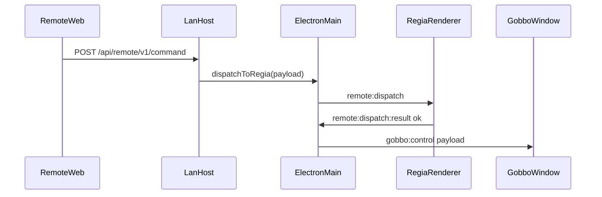

# Piano: pannello Titoli + pannello Gobbo (teleprompter)

## Contesto tecnico (codice esistente)

- **Uscita pubblico**: `[src/OutputApp.tsx](/Users/mauroandreoni/Regia%20Video/src/OutputApp.tsx)` compone video + layer immagine (`chalkboardLayer`, `playlistWatermark`). I comandi passano da `[electron/types.ts](/Users/mauroandreoni/Regia%20Video/electron/types.ts)` (`PlaybackCommand`) tramite `playback:send` → `forwardToOutput`.
- **Telecomando LAN**: `[electron/lan/remoteTypes.ts](/Users/mauroandreoni/Regia%20Video/electron/lan/remoteTypes.ts)` definisce `RemoteDispatchPayload`; `[electron/main.ts](/Users/mauroandreoni/Regia%20Video/electron/main.ts)` (`dispatchRemotePayloadToRegia`) invia a finestra regia `remote:dispatch`; la regia gestisce i tipi in `[src/state/RegiaContext.tsx](/Users/mauroandreoni/Regia%20Video/src/state/RegiaContext.tsx)` (es. `chalkboardBankToOutput`, `transport`).
- **Teleprompter vs titoli**: i **Titoli** sono overlay sul **PGM** (Schermo 2). Il **Gobbo** è un **uso separato** (testo lungo, scroll continuo): conviene una **finestra Electron dedicata** (mirroring opzionale, fullscreen su monitor prompter), **non** confondere con `titlesLayer` salvo scelta esplicita di riusare la stessa finestra (sconsigliato).

---

## Riferimento “leader di settore” (ambito realistico)

Allineare le funzioni **base** a ciò che offrono **Final Cut Pro** (Text inspector: font, stile, dimensione, allineamento, outline/ombra; preset titoli), **Premiere / Essential Graphics** (testo + riquadro, animazioni semplici), **DaVinci Resolve Text+** (tipografia avanzata progressiva). Per il Gobbo, modello **teleprompter hardware/software** + **app remote** (scroll, velocità, salto): il telecomando esistente è il punto naturale di integrazione.

**Fuori scope iniziale consigliato**: testo 3D, curve di animazione per-keyframe, import MOGRT.

---

## Parte A — Pannello **Titoli** (overlay PGM)

**Obiettivo**: inserire titoli sul programma con controlli tipo NLE + preset.

**Modello dati** (nuovo modulo, es. `[src/lib/regiaTitleDocument.ts](/Users/mauroandreoni/Regia%20Video/src/lib/regiaTitleDocument.ts)`): documento versionato con campi tipici inspector (font, peso, corsivo, dimensione, colore, allineamento, interlinea, tracking), riquadro opzionale (sfondo, padding, raggio, opacità), bordo/ombra testo, ancoraggio (lower third / centro / alto / ticker), **opacità globale**, **motion** base: nessuna, dissolvenza in/out, slide, **crawl** orizzontale, **roll** verticale (crediti), con durata/velocità clampate.

**Trasporto verso Output** (preferito rispetto al PNG continuo della lavagna): nuovo ramo in `PlaybackCommand`, es. `titlesLayer: { visible; doc: RegiaTitleDocumentV1; bust?: number }`, con **validazione e clamp** in `[electron/main.ts](/Users/mauroandreoni/Regia%20Video/electron/main.ts)` (lunghezza testo, numeri finiti) e **ultimo comando memorizzato** + flush su `did-finish-load` come `chalkboardLayer` / `playlistWatermark`.

**Rendering**: componente condiviso (es. `TitleOverlayView`) usato in `[src/OutputApp.tsx](/Users/mauroandreoni/Regia%20Video/src/OutputApp.tsx)` (layer assoluto, `pointer-events: none`, **z-index sopra** watermark e sotto o sopra lavagna secondo regola prodotto: default **sopra** tutto tranne eventuale logo programma) e, per coerenza, sopra l’anteprima programma in `[src/components/PreviewBlock.tsx](/Users/mauroandreoni/Regia%20Video/src/components/PreviewBlock.tsx)` quando “in onda” o “anteprima editor”.

**UI regia**: nuovo pannello (floater o sezione sidebar + apertura finestra dedicata, coerente con `[src/App.tsx](/Users/mauroandreoni/Regia%20Video/src/App.tsx)` / `[src/components/SidebarTabsPanel.tsx](/Users/mauroandreoni/Regia%20Video/src/components/SidebarTabsPanel.tsx)`): editor testo, controlli tipografici, aspetto, motion, **galleria preset** (JSON built-in: lower third, ticker, centrato breaking, crediti roll, bug testo).

**Stato**: `RegiaContext` o hook dedicato: `sendPlayback` su modifiche (debounce) quando il titolo è **in onda**; persistenza leggera in `localStorage` per ultimo documento + preset utente (opzionale file su disco in iterazione successiva).

---

## Parte B — Pannello **Gobbo** (teleprompter)

**Obiettivo**: incollare testo, impostare font/dimensione/colori/margini, **immagine di sfondo** salvata **insieme** al testo; **scroll** da **telecomando**; visualizzazione comoda per il presentatore.

**Requisiti confermati (specifica utente)**:

- **Incollare un testo**: flusso principale = area di editing ampia (textarea o equivalente), incolla da qualsiasi sorgente; nessun obbligo di formato ricco in v1.
- **Font, dimensione, ecc.**: stessi controlli tipografici “base” del resto dell’app (lista font / stack CSS, misura, colore, interlinea, margini lettura).
- **Scorrere con il telecomando**: comandi dedicati nel web telecomando (su/giù, autoscroll, velocità, inizio/fine) mappati su `RemoteDispatchPayload` → regia → finestra Gobbo.
- **Immagine di sfondo del Gobbo**: scelta da file; **persistenza unica** con il documento (cartella doc: manifest + copia immagine), così spostare o rinominare il file originale non invalida il salvataggio.

### Persistenza

- Formato **cartella documento** (analogo spirito alle playlist salvate): es. `userData/gobbo-docs/<id>/manifest.json` + `background.*` (copia file scelto dall’utente per non rompere il doc se sposta l’originale).
- `manifest`: testo (UTF-8), tipografia (font stack come `[ChalkboardPanel.tsx](/Users/mauroandreoni/Regia%20Video/src/components/ChalkboardPanel.tsx)`), dimensione, colore, padding, velocità autoscroll predefinita, flag mirror opzionale, path relativo sfondo.

### UI regia — `GobboPanel`

- Area incolla / editor, controlli font/taglia/colore/interlinea, scelta immagine sfondo, anteprima ridotta.
- Elenco documenti salvati, Salva / Carica / Nuovo.
- Pulsante **“Apri finestra Gobbo”** (finestra secondaria Electron).

### Finestra Gobbo

- Nuovo entry HTML (es. `gobbo.html` + `src/gobboMain.tsx`) caricato come `[output.html](/Users/mauroandreoni/Regia%20Video/src/output.tsx)`: viewport a schermo intero, testo in colonna scrollabile, immagine sfondo (`object-fit: cover` o `contain` configurabile), **margini sicuri** opzionali.
- **Scroll**: posizione verticale (`scrollTop` o `transform`) aggiornata da IPC; animazioni fluide (CSS/`requestAnimationFrame` per autoscroll).

### Telecomando — `[src/remote/RemoteApp.tsx](/Users/mauroandreoni/Regia%20Video/src/remote/RemoteApp.tsx)`

- Nuova tab: pulsanti grandi **su/giù** (step in px o % altezza viewport), **pagina su/giù** opzionale, **inizio/fine**, **play/pausa autoscroll**, slider velocità.
- Estendere `RemoteDispatchPayload` in `[electron/lan/remoteTypes.ts](/Users/mauroandreoni/Regia%20Video/electron/lan/remoteTypes.ts)`, es.: `gobboScrollBy`, `gobboScrollTo`, `gobboAutoscroll`, `gobboLoadSaved` (se si vuole cambiare doc da remoto).

### Instradamento comandi

- In `[src/state/RegiaContext.tsx](/Users/mauroandreoni/Regia%20Video/src/state/RegiaContext.tsx)`, gestire i nuovi `payload.type` nel listener `remote:dispatch` esistente.
- `**electron/main.ts`**: dopo conferma regia (come oggi), inoltrare comandi Gobbo alla **finestra Gobbo** se aperta (`webContents.send('gobbo:control', …)`); se chiusa, opzionale coda o no-op.
- **Preload** `[electron/preload.ts](/Users/mauroandreoni/Regia%20Video/electron/preload.ts)` + `[src/electron.d.ts](/Users/mauroandreoni/Regia%20Video/src/electron.d.ts)`: API per aprire/chiudere finestra, caricare doc, subscribe aggiornamenti.

### Snapshot WS (opzionale ma utile)

- Estendere `RemotePlaybackSnapshotV1` con indicatori minimi (`gobboOpen`, `gobboDocTitle`, `gobboScrollRatio`) per mostrare stato sul telecomando.

---

## Diagramma flusso Gobbo + telecomando

---

## Ordine di implementazione suggerito

1. **Gobbo**: tipi persistenza + IPC + finestra + tab telecomando + pannello regia (percorso verticale completo, valore immediato).
2. **Titoli**: `PlaybackCommand` + view Output + pannello + preset + anteprima programma.

---

## Rischi / decisioni

- **Font**: come la lavagna, partire da stack CSS curati + campo “famiglia personalizzata”; font di sistema completi richiedono API native aggiuntive (fase successiva).
- **Sicurezza**: limiti su dimensione testo e frequenza comandi scroll da remoto (anti-flood).
- **Due monitor**: posizionamento finestra Gobbo sul display scelto (riuso logica posizionamento da output dove possibile).

