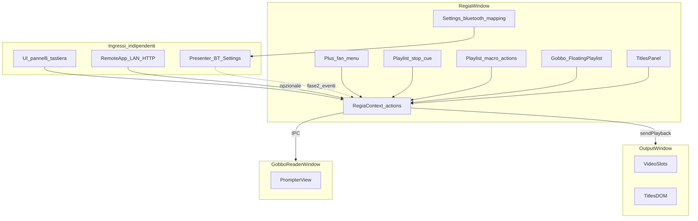

# Piano: Playlist (stop + macro), Titoli/Gobbo (preset a cartelle), Gobbo singleton, Bluetooth, «+»

## Contesto tecnico

L’app è Electron con finestra **Regia** (Vite/React) e finestra **Output** ([`src/OutputApp.tsx`](src/OutputApp.tsx)): gli overlay PGM oggi passano da `sendPlayback` con comandi definiti in [`electron/types.ts`](electron/types.ts) / [`src/playbackTypes.ts`](src/playbackTypes.ts) (es. `chalkboardLayer` come PNG, `playlistWatermark`).

**Due canali di controllo distinti (non vanno confusi):**

1. **Telecomando via rete (LAN)** — già esistente: [`src/remote/RemoteApp.tsx`](src/remote/RemoteApp.tsx) + [`electron/lan/LanHost.ts`](electron/lan/LanHost.ts), comandi HTTP → `RemoteDispatchPayload` → [`RegiaContext.tsx`](src/state/RegiaContext.tsx). È un prodotto separato dal Bluetooth.
2. **Presenter Bluetooth** — **nuova funzione**, con **solo** un’area dedicata in **Impostazioni** (learning + mapping). Deve poter comandare **tutta** la regia (trasporto, playlist, titoli, **scroll Gobbo tra le altre azioni**, ecc.): **non** è accoppiato al Gobbo e **non** sostituisce il telecomando LAN.

Le **azioni interne** della regia (es. “scroll Gobbo su/giù”, “play/pausa”) possono essere invocate da più ingressi (UI pannello, tastiera, LAN se esteso, tasti Bluetooth mappati): una piccola tabella centralizzata di `dispatchAction(actionId, payload)` evita di legare il Gobbo a un solo ingresso.

---

## 1) Pannello TITOLI (overlay PGM)

**Riferimento funzionale** (baseline da software di settore: Final Cut “Text inspector”, Premiere Essential Graphics, Resolve Text+): font, stile/peso, dimensione, allineamento, colore, interlinea/tracking, ombra/bordo, riquadro/sfondo (lower third), opacità globale, posizione (preset: basso/centro/alto, margini sicuri), **motion** base: statico, dissolvenza in/out, slide, **crawl** (ticker orizzontale), **roll** (crediti verticali).

**Architettura consigliata**: nuovo comando IPC `titlesLayer` con **payload JSON** (non PNG continuo), così tipografia e animazioni CSS restano fluide. Allineamento a pattern esistente: `lastChalkboardLayerForOutput` in [`electron/main.ts`](electron/main.ts) → analogo `lastTitlesLayerForOutput` + `flush` al `did-finish-load` della finestra Output.

**Implementazione**

- Tipi e validazione: estendere [`electron/types.ts`](electron/types.ts) e [`src/playbackTypes.ts`](src/playbackTypes.ts); in `playback:send` clampare stringhe numeriche (lunghezza testo, fontSize, opacità).
- Output: in [`src/OutputApp.tsx`](src/OutputApp.tsx) aggiungere layer DOM (es. `.output-titles-layer`, `z-index` sopra lavagna/watermark come da UX broadcast) che mappa il JSON in stili React/CSS (`@keyframes` per crawl/roll/fade).
- Regia: nuovo modulo tipi/preset (es. [`src/lib/regiaTitleTypes.ts`](src/lib/regiaTitleTypes.ts)) + componente presentazionale condiviso (es. `TitleOverlayFrame`) usato da Output e dall’anteprima programma.
- Anteprima: in [`src/components/PreviewBlock.tsx`](src/components/PreviewBlock.tsx) (o wrapper da [`PreviewProgramNextLayout.tsx`](src/components/PreviewProgramNextLayout.tsx)) sovrapporre lo stesso overlay quando i titoli sono “in onda” o in anteprima modifica.
- UI pannello: nuovo componente (es. [`src/components/TitlesPanel.tsx`](src/components/TitlesPanel.tsx)) aperto dalla sidebar ([`SidebarTabsPanel.tsx`](src/components/SidebarTabsPanel.tsx)) e/o floater; controlli raggruppati (Testo, Tipografia, Aspetto, Posizione, Movimento).
- **Preset Titoli (stesso paradigma del Gobbo)**: oltre a preset di fabbrica, **libreria utente** con **cartelle e sottocartelle** (navigazione tipo plugin **Waves**: albero a sinistra o breadcrumb + elenco). Salvataggio su disco (file JSON o pacchetti per preset) sotto una radice dedicata (es. userData / cartella documenti app).
- Stato: `RegiaContext` o hook dedicato; `sendPlayback({ type: 'titlesLayer', ... })` su modifica (debounce) quando “in onda”; persistenza bozza in `localStorage` (chiave versionata) oltre ai preset su file.

**Fuori scope iniziale** (da citare nel piano): testo 3D, curve keyframe complesse, import MOGRT.

---

## 2) GOBBO — **nuovo tipo di pannello** (come playlist / launchpad / chalkboard)

**Chiarimento**: il Gobbo **non** è accessorio al telecomando. È un **nuovo `playlistMode`** (es. `'gobbo'`) in [`floatingPlaylistSession.ts`](src/state/floatingPlaylistSession.ts), con UI in [`FloatingPlaylist.tsx`](src/components/FloatingPlaylist.tsx) e salvataggio negli elenchi salvati ([`playlistTypes.ts`](src/playlistTypes.ts), [`SavedPlaylistsPanel.tsx`](src/components/SavedPlaylistsPanel.tsx)).

**Unicità (singleton) — requisito**

- **Un solo Gobbo “logico”** in interfaccia: **non** si supportano più sessioni `gobbo` aperte contemporaneamente. Dal menu **«+»** / apertura: se il Gobbo esiste già, **portarlo in primo piano** (stesso pattern “unicità” già intuitivo per strumenti tipo promemoria).
- Finestra **lettore** promemoria: al massimo **una** finestra collegata a quel pannello; riaprire = riattacca o aggiorna la stessa.
- **Scroll Bluetooth / LAN**: sempre verso **questo** unico stato Gobbo (niente scelta tra più sessioni).

**Libreria preset (stile Waves / plugin audio)**

- All’interno del pannello: **salvare**, **rinominare**, **eliminare** preset del testo+aspetto+sfondo (bundle su disco).
- **Organizzazione in cartelle e sottocartelle**: navigazione ad albero (come preset di plugin), import/export opzionale in seguito.
- Preset di **fabbrica** in codice + spazio **utente** sotto radice dedicata su disco.

**Contenuto del pannello (regia)**

- Incollare / modificare **testo**; **font**, **dimensione**, colori, margini, allineamento.
- **Immagine di sfondo** opzionale: salvata **nel bundle** del documento (JSON + copia file in cartella preset/salvato), come già descritto per coerenza con altri asset su disco.
- **Scroll manuale**: slider, rotellina, pulsanti nel pannello; la stessa funzione interna `applyGobboScroll(delta | 'pageUp' | …)` (senza ambiguità di `sessionId` multipli) sarà richiamabile da **altrove** (vedi sotto).
- **Modalità Auto**: **switch** on/off. Con Auto on, **menu a tendina** con **quattro velocità**: **1×**, **2×**, **4×**, **8×** (moltiplicatori rispetto a una velocità base in px/s definita in codice, con `requestAnimationFrame` o animazione CSS controllata). Con Auto off, solo scroll manuale.
- Pulsante **“Apri finestra Gobbo”** (monitor presentatore): finestra Electron separata da PGM (`gobbo.html` + `GobboApp.tsx`, entry in [`vite.config.ts`](/Users/mauroandreoni/Regia%20Video/vite.config.ts)), sincronizzata via IPC con la sessione attiva (documento + `scrollOffset` + stato Auto/velocità).

**Modello dati (campi tipici nella sessione o sotto-oggetto `gobbo`)**

- `body`, tipografia, `backgroundImagePath` / bundle, `scrollOffsetPx` (o ratio).
- `autoScrollEnabled: boolean`, `autoScrollSpeed: '1x' | '2x' | '4x' | '8x'`.

**Telecomando Bluetooth vs Gobbo**

- Il **Bluetooth** (Impostazioni) resta **globale** e **non** accoppiato al Gobbo; tra le azioni mappabili: es. “Gobbo: scroll su/giù/pagina” verso l’**unico** pannello Gobbo.

**Telecomando LAN (telefono in rete)** — opzionale, separato dal Bluetooth

- Se utile, si può aggiungere una scheda o pulsanti in [`RemoteApp.tsx`](src/remote/RemoteApp.tsx) che inviano comandi HTTP già previsti da [`remoteTypes.ts`](electron/lan/remoteTypes.ts): sono **solo** un’altra UI che chiama le **stesse** `applyGobboScroll` / trasporto della regia. Non sostituiscono e non condividono stack con il presenter Bluetooth.

**File chiave**

- Estensione tipo sessione + revive/persist: [`floatingPlaylistSession.ts`](src/state/floatingPlaylistSession.ts), [`RegiaContext.tsx`](src/state/RegiaContext.tsx), persistenza `playlistsSave`/`Load`.
- UI corpo pannello: componente dedicato montato da `FloatingPlaylist` quando `playlistMode === 'gobbo'` (analogo a [`ChalkboardPanel.tsx`](src/components/ChalkboardPanel.tsx)).
- [`electron/main.ts`](electron/main.ts), [`electron/preload.ts`](electron/preload.ts), [`vite.config.ts`](vite.config.ts): finestra lettura + IPC.

---

## 3) Creazione pannelli: un solo «+» e ventaglio di scelte

**Situazione attuale**: in [`src/components/SavedPlaylistsPanel.tsx`](src/components/SavedPlaylistsPanel.tsx) la riga `saved-playlists-new-row` (circa 444–508) espone **quattro** pulsanti affiancati (playlist vuota, launchpad vuoto, launchpad preset SFX, chalkboard).

**Obiettivo**: un **unico** pulsante primario «+» che apre un **menu a ventaglio** (o popover radiale / arco di icone + etichette, stesso comportamento di scelta unica) con le voci:

| Voce | Azione |
|------|--------|
| Playlist | `addFloatingPlaylist()` + `openFloatingPlaylist()` (come oggi) |
| Launchpad vuoto | `addFloatingLaunchPad('base')` + apri |
| Launchpad preset | `addFloatingLaunchPad('sfx')` + apri |
| Chalkboard | `addFloatingChalkboard()` + apri |
| Titoli | Apre il **pannello Titoli** (strumento overlay PGM: stato/floater dedicato, **non** è una `FloatingPlaylistSession` a meno di non riprogettarlo) |
| Gobbo | **`ensureGobboPanel()`** (nome indicativo): se non esiste, crea **una** sessione `playlistMode: 'gobbo'`; se esiste già, **focus** (singleton — non duplicare) |

**Implementazione**: estrarre un componente dedicato (es. `NewPanelFanMenu.tsx`) con gestione focus, chiusura su Escape e click fuori, accessibilità (`aria-expanded`, `role="menu"`). Riutilizzare le stesse `data-preview-hint` già usate dai pulsanti attuali ([`src/lib/panelPreviewHints.ts`](src/lib/panelPreviewHints.ts)). Aggiornare CSS (`saved-playlists-new-row`) per un solo trigger + overlay. Nota: con `listOnly` i pulsanti sono già nascosti; mantenere la stessa regola o duplicare il «+» nel contesto che oggi gestisce i pulsanti “fuori” se serve coerenza.

**Ordine suggerito rispetto a Titoli/Gobbo**: introdurre il menu quando i pannelli Titoli/Gobbo esistono almeno come stub (aprono UI vuota o placeholder), così il ventaglio è completo fin da subito.

---

## 4) Stop nelle playlist (messaggio + colore)

**Obiettivo**: nelle playlist a **brani** (`playlistMode` assente o `tracks`), poter inserire nel coda voci di tipo **stop** (non sono file media): ogni stop ha **messaggio** (testo breve) e **colore** (es. hex `#rrggbb`, come i temi playlist esistenti).

**Modello dati** (sostituisce gradualmente l’elenco solo-path):

- Oggi: [`FloatingPlaylistSession`](src/state/floatingPlaylistSession.ts) usa `paths: string[]` (solo file).
- Proposto: `playlistItems: PlaylistItem[]` dove  
  `PlaylistItem = { kind: 'media'; path: string } | { kind: 'stop'; … } | { kind: 'macro'; … }` (dettaglio macro: **sezione 5** sotto).  
  In lettura da disco/sessioni vecchie: **migrazione** da `paths: string[]` → tutte voci `media` (comportamento identico all’attuale).

**UI** ([`FloatingPlaylist.tsx`](src/components/FloatingPlaylist.tsx)):

- Voce “Aggiungi stop…” nel menu contestuale / pulsante accanto ad “aggiungi file” (stesso flusso DnD: riordinabile).
- Riga elenco dedicata: anteprima colore, messaggio, modifica (inline o piccolo dialog), elimina.
- Indice corrente / evidenziazione come per i brani quando lo **stop** è la voce “in onda”.

**Riproduzione** ([`RegiaContext.tsx`](src/state/RegiaContext.tsx) — `loadIndexAndPlay`, `goNext` / `goPrev`, ARM “prossimo”):

- Su voce **media**: invariato (`sendPlayback` load, ecc.).
- Su voce **stop**: **non** caricare alcun nuovo media su Output; **non** inviare overlay “stop” a Schermo 2. Impostare stato `playlistStopActive` e mostrare messaggio/colore **solo** in **cabina regia** (pannello playlist, eventuale evidenziazione anteprima **locale**, elenco telecomando LAN se previsto): è un **cue operatore**, non un segnale al pubblico.
- **Uscita PGM** ([`src/OutputApp.tsx`](/Users/mauroandreoni/Regia%20Video/src/OutputApp.tsx)): durante uno stop resta **l’ultimo frame (o stato visivo) dell’ultimo file già in riproduzione** — nessun dissolvenza a nero e nessun messaggio stop sul monitor esterno, salvo esplicita richiesta futura diversa.
- Trasporto: **pausa totale** (audio **e** video fermi sullo stato del brano precedente), coerente col fatto che non c’è nuovo clip finché l’operatore non conferma **Avanti** / **Play** / **Next** verso la voce successiva (**requisito confermato**).
- `goNext` da uno stop: passa alla voce successiva (media o stop).

**Persistenza**:

- Estendere il JSON salvato/caricato via `playlistsSave` / `playlistsLoad` ([`electron/preload.ts`](electron/preload.ts)) e ogni punto che serializza `paths` (baseline `savedEditPathsBaseline`, cloud, bug snapshot) con versione o campo parallelo `playlistItems`; test di round-trip con playlist vecchie senza campo.

**Derivazioni**:

- [`sumMediaDurationsSec`](src/lib/sumMediaDurationsSec.ts) / durata totale: **ignorare** voci **stop** e **macro** nel conteggio (nessun file associato).
- Telecomando LAN / selezione indice: se l’indice è uno stop, **stesso cue solo in regia** (nessun cambiamento sul flusso `sendPlayback` verso Output oltre al “non toccare il PGM” sopra).

**Requisito fissato (non opzionale)**: lo stop **non** si vede “fuori”; il PGM non mostra messaggio né colore dello stop.

---

## 5) **Macro** nelle playlist (cuore plancia — evoluzione dopo stop)

**Visione**: le playlist a brani restano lo **strumento centrale** della plancia. Oltre ai brani, agli **stop** (cue cabina, pausa totale, PGM invariato) si aggiungono le **macro**: voci in coda **graficamente simili** allo stop (riga dedicata, icona/colore distintivo), ma invece di “fermare” eseguono **azioni**.

**Esempio citato**: una macro **apre** un’altra playlist (salvata) e ne avvia la **riproduzione** (es. pacchetto audio / scaletta pronta).

**Modello dati** (estensione di `playlistItems`):

- `PlaylistItem` include anche `{ kind: 'macro'; id: string; label: string; color?: string; action: MacroAction }`.
- `MacroAction` iniziale versionabile: es. `{ type: 'loadSavedPlaylistAndPlay'; savedPlaylistId: string; target?: 'output' | 'preview' }` — i dettagli di **quale uscita** comanda la macro (solo audio, sessione PGM attuale, nuovo pannello flottante) vanno definiti in implementazione e documentati.

**Esecuzione**

- Quando `loadIndexAndPlay` raggiunge una macro: eseguire l’azione in modo **atomico** dove possibile, loggare errori (playlist mancante), aggiornare stato UI; **non** lasciare la coda “appesa” senza feedback.
- **PGM**: per la prima versione conviene una policy esplicita — es. macro che caricano altra playlist cambiano **solo** la sessione/pannello di destinazione scelto dall’utente nella definizione della macro, senza sorprese sul video se la macro è solo “audio”; se la macro include video, allineare al comportamento di “carica e play” già usato dalla regia.

**Rischi / guardrail (parere di design, da rifinire)**:

- **Loop o catene**: due macro che si richiamano a vicenda — prevedere limite di profondità o timeout e messaggio in cabina.
- **Chi comanda l’uscita**: con più playlist aperte, la macro deve dichiarare **obiettivo** (es. “porta in onda questa saved id sulla sessione X” o “solo apri pannello”).
- **Sicurezza operativa**: opzione “conferma prima di eseguire” per macro distruttive (opzionale in Impostazioni playlist).

**UI**: stesso elenco riordinabile di [`FloatingPlaylist.tsx`](src/components/FloatingPlaylist.tsx); editor macro (tipo + parametri + colore/etichetta).

**Persistenza**: stesso flusso JSON delle altre voci `playlistItems`.

---

## 6) **Nuova** area Impostazioni: presenter **Bluetooth** (learning) — **globale**

**Chiarimento**: questa sezione è **solo** per il **nuovo** telecomando **Bluetooth**. Non sostituisce il telecomando **LAN** esistente e **non** va pensata come parte del Gobbo: il Gobbo è un tipo di pannello; il Bluetooth è un ingresso hardware **che funziona ovunque** nella regia.

**Dove**: [`src/components/SettingsModal.tsx`](src/components/SettingsModal.tsx) — nuovo `SettingsSectionId` (es. `bluetoothPresenter`) e `SettingsCollapsibleSection` dedicata (titolo chiaro: es. «Presenter Bluetooth»).

**Obiettivo funzionale**

- **Learning**: assegnazione di ogni tasto fisico a un’**azione globale** (elenco estensibile): es. play/pausa, avanti brano, volume su/giù, undo, **scroll Gobbo** (su/giù/pagina), take titoli, ecc.
- **Persistenza**: mappa `buttonId → actionId` (+ opzioni) in storage stabile (userData via IPC o file dedicato).
- **Fase 1**: UI completa di mapping e testi; stack reale Bluetooth/HID/BLE in **fase 2** (processo main che emette eventi verso la regia applicando la mappa).
- Le azioni devono richiamare lo **stesso strato interno** usato da UI e tastiera (ed eventualmente da comandi LAN se previsti), così il Bluetooth non duplica logica per feature.

**Esempio d’uso citato dall’utente**: sul Gobbo il Bluetooth sarà **utile** per lo **scroll manuale** della pagina — è solo **una** delle azioni possibili, non l’unico scopo del dispositivo.

**File nuovi possibili**: [`src/lib/bluetoothPresenterMappingStorage.ts`](src/lib/bluetoothPresenterMappingStorage.ts), [`src/components/SettingsBluetoothPresenterSection.tsx`](src/components/SettingsBluetoothPresenterSection.tsx).

---

## 7) Ordine di lavoro suggerito

1. **UI «+» ventaglio** (Gobbo = singleton `ensureGobboPanel`).
2. **Stop playlist**: tipi + migrazione + UI + riproduzione + disco.
3. **Macro playlist** (MVP): modello + una azione (`loadSavedPlaylistAndPlay`) + UI riga + guardrail base.
4. **Gobbo**: tipo pannello singleton + editor + **libreria preset a cartelle** + finestra lettura + **Auto + 1×/2×/4×/8×**.
5. **Titoli**: overlay PGM + **libreria preset a cartelle** (pari paradigma al Gobbo).
6. **Impostazioni → Bluetooth**: area dedicata + mapping + learning UI; stack hardware fase 2.
7. **Opzionale**: Remote LAN scroll Gobbo.
8. Rifiniture: HINT, filtri sidebar `gobbo`, test Schermo 2 + LAN.

**Parere sulle macro**: sono coerenti con l’idea “playlist = motore della plancia”: trasformano la scaletta in **automazione leggera** senza diventare uno script generico. Conviene introdurle **dopo** stop e modello `playlistItems`, con **poche** azioni ben tipizzate all’inizio; espandere quando i flussi utente sono chiari.

**Nota sul diagramma**: Gobbo session e finestra lettura sono collegati da IPC; **Bluetooth** e **LAN** entrano in `RegiaContext` per percorsi diversi; nessuno è prerequisito dell’altro.
